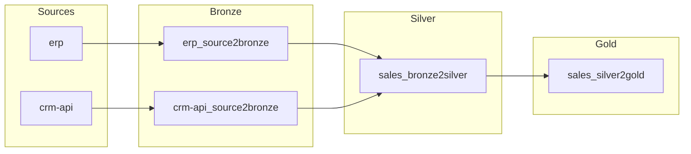

# Architecture Design — {{ project_name }}

**Date:** {{ date }}
**Discovery Reports:** `.datacoolie/discover/`
**Platform:** {{ platform }}
**Status:** Draft — Awaiting Approval

---

## Overview

- **Source count:** {{ source_count }}
- **Target platform:** {{ platform }}
- **Estimated daily volume:** {{ estimated_volume }}
- **Medallion layers:** {{ layer_count }} ({{ layer_names }})

---

## Architecture Diagram

> _Replace node names with actual source and stage names from the Stage Definitions below. Add or remove nodes to match._

---

## Medallion Layers

### Bronze (Raw Ingestion)

- **Purpose:** Land source data with minimal transformation (schema enforcement only)
- **Storage:** {{ bronze_storage }}
- **Format:** Delta / Parquet
- **Retention:** {{ bronze_retention | default("90 days") }}
- **Naming:** `{source_name}/{table_name}/`

### Silver (Cleansed & Conformed)

- **Purpose:** Deduplicated, typed, business-ready entities
- **Storage:** {{ silver_storage }}
- **Format:** Delta
- **Retention:** {{ silver_retention | default("Unlimited") }}
- **Naming:** `{domain}/{entity_name}/`

### Gold (Aggregated / Serving)

- **Purpose:** Business metrics, reporting tables, API-ready datasets
- **Storage:** {{ gold_storage }}
- **Format:** Delta / Table
- **Retention:** {{ gold_retention | default("Unlimited") }}
- **Naming:** `{domain}/{metric_or_view_name}/`

---

## Stage Definitions

| Stage Name | Source | Destination | Load Type | Engine | Schedule |
|---|---|---|---|---|---|
| {{ stage_rows }} |

### Stage Details

<!-- Repeat for each stage: -->
<!--
#### {stage_name}

- **Source connection:** {connection_name}
- **Source table / endpoint:** {table or endpoint path}
- **Destination:** {layer}/{path}
- **Load type:** {full_load | overwrite | append | merge_upsert | merge_overwrite | scd2}
- **Watermark column:** {column or N/A}
- **Merge keys:** {PK columns or N/A}
- **Transform logic:** {brief description}
-->

---

## Infrastructure Requirements

| Platform | Resource Type | Name | Purpose |
|---|---|---|---|
| {{ infra_rows }} |

### Resource Details

<!-- Example for Fabric: -->
<!--
- **Workspace:** {workspace_name}
- **Bronze Lakehouse:** {name} — raw ingestion landing
- **Silver Lakehouse:** {name} — cleansed entities
- **Gold Warehouse:** {name} — serving / reporting layer
- **Key Vault:** {name} — secrets management
-->

---

## Engine Strategy

| Stage Pattern | Engine | Rationale |
|---|---|---|
| *_source2bronze | polars | Lightweight I/O, no cluster overhead |
| *_bronze2silver | polars or spark | Simple transforms, data fits in memory |
| *_silver2gold | {{ gold_engine }} | {{ gold_engine_rationale }} |

---

## Partitioning Strategy

| Layer | Table | Partition Columns | Expression |
|---|---|---|---|
| {{ partition_rows }} |

---

## Environment Differences

| Aspect | Dev | Test | Prod |
|---|---|---|---|
| Engine | polars | mixed | mixed (per stage) |
| Storage | local files | cloud (test workspace) | cloud (prod workspace) |
| Schedule | manual trigger | daily | per stage definition |
| Data volume | sample (1000 rows) | full | full |
| Secrets | .env file | Key Vault (test) | Key Vault (prod) |
| Monitoring | console logs | basic alerts | full alerting + SLA |

---

## Risks & Mitigations

| Risk | Likelihood | Impact | Mitigation |
|---|---|---|---|
| {{ risk_rows }} |

---

## Approval

> **Reviewer:** Please review the architecture above. Reply with:
> - `approve` — proceed to metadata generation and provisioning
> - Specific feedback — I will iterate on the design

**Status:** {{ status | default("⏳ Awaiting review") }}
