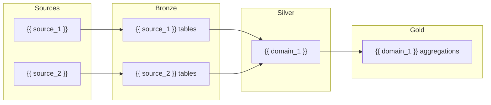

# Architecture Design — {{ project_name }}

## Overview

- **Source count:** {{ source_count }}
- **Target platform:** {{ platform }}
- **Estimated daily volume:** {{ estimated_volume }}
- **Medallion layers:** {{ layer_count }} ({{ layer_names }})

---

## Source Registry

| Source | Type | Discovered | Arch Version | Tables | Stage Impact | Status |
|--------|------|-----------|-------------|--------|-----------|--------|
| {{ source_registry_rows }} |

**Status values:** `Active` — current; `New` — just added, pending approval; `Modified` — re-discovered with changes; `Retired` — removed from pipeline

---

## Source Overview

<!-- Inline mode: source details listed here. Split mode: see layers/source.md -->

<!-- Repeat for each source: -->
<!--
### {{ source_name }}

- **Type:** {{ connection_type }} (database / API / file / lakehouse)
- **Protocol:** {{ protocol }}
- **Schedule:** {{ schedule }}
- **CDC available:** {{ cdc_available }}
- **Estimated volume:** {{ volume }}
- **Access:** {{ access_notes }}
-->

---

## Architecture Diagram



> _Replace node names with actual sources and domains. Add or remove nodes to match._

---

## Medallion Layers

### Bronze (Raw Ingestion)

- **Purpose:** Land source data with minimal transformation (schema enforcement only)
- **Storage:** {{ bronze_storage }}
- **Format:** Delta / Parquet
- **Retention:** {{ bronze_retention | default("90 days") }}
- **Naming:** `{source_name}/{table_name}/`

### Silver (Cleansed & Conformed)

- **Purpose:** Deduplicated, typed, business-ready entities
- **Storage:** {{ silver_storage }}
- **Format:** Delta
- **Retention:** {{ silver_retention | default("Unlimited") }}
- **Naming:** `{domain}/{entity_name}/`

### Gold (Aggregated / Serving)

- **Purpose:** Business metrics, reporting tables, API-ready datasets
- **Storage:** {{ gold_storage }}
- **Format:** Delta / Table
- **Retention:** {{ gold_retention | default("Unlimited") }}
- **Naming:** `{domain}/{metric_or_view_name}/`

---

## Stage Summary Table

| Stage | Layer Boundary | Source Domains | Target Grain | Load Pattern | Key Strategy | Freshness | Default Engine | Quality Gate |
|-------|----------------|----------------|--------------|--------------|--------------|-----------|--------|--------------|
| {{ stage_summary_rows }} |

> This table is always present in the master file regardless of split mode.

### Stage Contracts

<!-- Inline mode: stage contracts listed here. Split mode: see layers/{layer}.md -->

<!-- Repeat for each stage/layer boundary: -->
<!--
#### {{ stage_name }}

- **Layer boundary:** {{ layer_boundary }} (source2bronze / bronze2silver / silver2gold)
- **Source domains:** {{ source_domains }}
- **Target grain:** {{ target_grain }}
- **Load pattern:** {{ load_pattern }}
- **Change detection:** {{ change_detection }}
- **Key strategy:** {{ key_strategy }}
- **Freshness target:** {{ freshness_target }}
- **Default engine:** {{ engine }} (`polars` or `spark`)
- **Platform/storage:** {{ platform_storage }}
- **Partitioning principle:** {{ partitioning_principle }}
- **Quality gate:** {{ quality_gate }}
- **Backfill/rollback:** {{ backfill_rollback }}
-->

<!-- Split mode: replace the above with:
> **Split mode:** Stage contracts organized by layer:
> - [Source details](layers/source.md)
> - [Bronze contracts](layers/bronze.md)
> - [Silver contracts](layers/silver.md)
> - [Gold contracts](layers/gold.md)
-->

---

## Infrastructure Requirements

| Platform | Resource Type | Name | Purpose |
|---|---|---|---|
| {{ infra_rows }} |

### Resource Details

<!-- Example for Fabric: -->
<!--
- **Workspace:** {workspace_name}
- **Bronze Lakehouse:** {name} — raw ingestion landing
- **Silver Lakehouse:** {name} — cleansed entities
- **Gold Warehouse:** {name} — serving / reporting layer
- **Key Vault:** {name} — secrets management
-->

---

## Engine Strategy

Engine strategy is a matrix by environment and stage. Each engine value must be one concrete
runtime engine: `polars` or `spark`. There is no third engine value; using both engines means
the runner/deploy artifact selects a concrete engine per environment and stage.

| Environment | Stage | Engine | Rationale | Runner/Deploy Impact |
|---|---|---|---|---|
| dev | source2bronze | polars | Fast local iteration | Local runner uses PolarsEngine for this stage |
| dev | bronze2silver | polars | Fast local iteration | Local runner uses PolarsEngine for this stage |
| dev | silver2gold | polars | Sample/small dev data | Local runner uses PolarsEngine unless Spark parity is required |
| test | source2bronze | {{ test_s2b_engine }} | {{ test_s2b_engine_rationale }} | Generated test runner/deploy selects this engine |
| test | bronze2silver | {{ test_b2s_engine }} | {{ test_b2s_engine_rationale }} | Generated test runner/deploy selects this engine |
| test | silver2gold | {{ test_s2g_engine }} | {{ test_s2g_engine_rationale }} | Generated test runner/deploy selects this engine |
| prod | source2bronze | {{ prod_s2b_engine }} | {{ prod_s2b_engine_rationale }} | Generated prod runner/deploy selects this engine |
| prod | bronze2silver | {{ prod_b2s_engine }} | {{ prod_b2s_engine_rationale }} | Generated prod runner/deploy selects this engine |
| prod | silver2gold | {{ prod_s2g_engine }} | {{ prod_s2g_engine_rationale }} | Generated prod runner/deploy selects this engine |

---

## Partitioning Strategy

| Layer | Table | Partition Columns | Expression |
|---|---|---|---|
| {{ partition_rows }} |

---

## Architecture Amendments

Architecture changes discovered during implementation must be recorded under:

```text
{project_name}_dcws/architecture/amendments/YYMMDD_<change>.md
```

Breaking amendments stop downstream work until approved. Non-breaking amendments require lightweight review before continuing.

---

## Environment Differences

| Aspect | Dev | Test | Prod |
|---|---|---|---|
| Engine strategy | per Engine Strategy matrix | per Engine Strategy matrix | per Engine Strategy matrix |
| Storage | local files | cloud (test workspace) | cloud (prod workspace) |
| Schedule | manual trigger | daily | per stage definition |
| Data volume | sample (1000 rows) | full | full |
| Secrets | .env file | Key Vault (test) | Key Vault (prod) |
| Monitoring | console logs | basic alerts | full alerting + SLA |

---

## Risks & Mitigations

| Risk | Likelihood | Impact | Mitigation |
|---|---|---|---|
| {{ risk_rows }} |

---

## Changelog

### v{{ version | default("1") }} — {{ date }}
{{ changelog_entries }}

<!-- Older versions below, newest first -->

---

## Approval

> **Reviewer:** Please review the architecture above and record the gate journal under
> `{project_name}_dcws/project_management/phases/architecture/gate-reviews/`. Reply with:
> - `approve` — record the architecture gate and allow `source2bronze`
> - Specific feedback — I will iterate on the design

**Status:** {{ status | default("⏳ Awaiting review") }}
