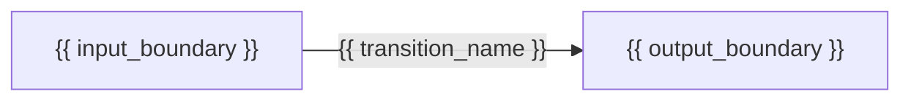

# Architecture — {{ project_name }}

## Scope

- Goal: {{ desired_outcome }}
- In scope: {{ in_scope }}
- Out of scope: {{ out_of_scope }}
- Constraints: {{ constraints_or_none }}

## Evidence And Assumptions

| Topic | Statement | Basis | Evidence path or validation owner |
|---|---|---|---|
| {{ topic }} | {{ statement }} | observed / required / assumed / unresolved | {{ path_or_owner }} |

Do not promote assumptions to facts. Route unknown source facts to discovery and exact runtime
capability proof to build.

## Stage Graph

The graph expresses dependencies and data boundaries. Stage names are project-defined and must not
imply a platform, engine, or storage format.

## Transition Summary

| Transition | Inputs | Outputs | Target grain | Load behavior | Owner | Depends on |
|---|---|---|---|---|---|---|
| {{ transition_rows }} |

## Transition Contracts

<!-- Repeat this section for every in-scope transition. -->

### {{ transition_name }}

- Inputs and ownership: {{ inputs_and_ownership }}
- Outputs and ownership: {{ outputs_and_ownership }}
- Target grain: {{ target_grain }}
- Business and technical keys: {{ key_contract }}
- Load behavior: {{ full_append_merge_or_cdc }}
- Change detection and replay window: {{ change_detection_and_replay }}
- Schema evolution: {{ compatible_and_incompatible_change_behavior }}
- Idempotency and deduplication: {{ idempotency_and_deduplication }}
- Late data and backfill: {{ late_data_and_backfill }}
- Storage, format, and partition intent: {{ choices_with_rationale_or_not_applicable }}
- Quality and reconciliation gate: {{ observable_pass_conditions }}
- Freshness, runtime, and cost targets: {{ targets_or_unknown }}
- Failure recovery, rollback, and replay: {{ recovery_contract }}

## Framework Capability Intent

| Dimension | Intended capability | Confidence | Evidence | Build-time proof required |
|---|---|---|---|---|
| Source | {{ source_intent }} | credible / unknown / gap | {{ evidence }} | {{ proof }} |
| Authentication | {{ authentication_intent }} | credible / unknown / gap | {{ evidence }} | {{ proof }} |
| Engine | {{ compatible_engine_intent }} | credible / unknown / gap | {{ evidence }} | {{ proof }} |
| Transforms | {{ transform_intent }} | credible / unknown / gap | {{ evidence }} | {{ proof }} |
| Destination | {{ destination_intent }} | credible / unknown / gap | {{ evidence }} | {{ proof }} |
| Load | {{ load_intent }} | credible / unknown / gap | {{ evidence }} | {{ proof }} |
| Platform | {{ platform_intent }} | credible / unknown / gap | {{ evidence }} | {{ proof }} |
| Dependencies | {{ dependency_intent }} | credible / unknown / gap | {{ evidence }} | {{ proof }} |

Prefer a native DataCoolie route when credible. A suspected gap identifies only the unsupported
boundary; build must prove it before introducing narrow custom code.

## Python Function Packaging Intent

- Required: {{ yes_or_no }}
- Format: {{ wheel_zip_or_none }}
- Distribution: {{ project_distribution_or_not_applicable }}
- Import prefix: {{ project_specific_prefix_or_not_applicable }}
- Dependency strategy: {{ pinned_wheel_requirements_or_approved_runtime_only }}
- Compatible execution targets and attachment mechanisms: {{ targets_or_not_applicable }}
- Rationale and unsupported boundary: {{ rationale_or_not_applicable }}
- Build proof: package inspection, isolated import, signature validation, and representative
  function-backed runtime execution when required.

Select one format for the build, never both. Prefer `wheel`; select `zip` only for a compatible
pure-Python execution host. Packaging and attachment remain Build and Release responsibilities.

## Runtime Selection Intent

- Execution hosts and platform runtime modes: {{ execution_hosts_and_platform_runtime_modes }}
- Runner deployment kinds and native target identities: {{ runner_deployment_kinds_and_targets }}
- Compatible platform/engine combinations: {{ compatible_platform_engine_combinations }}
- Runtime selection rule: invoke the exact runner or notebook for the selected platform and engine.
- Stage execution rule: pass one stage value to the selected runner; do not encode stage-to-engine mappings
  in project config or architecture.
- Required runtime paths and provider inputs: {{ metadata_logs_watermarks_and_provider_inputs }}

## DataCoolie Control Storage

- Control resource and environment namespace: {{ control_resource_and_environment_namespace }}
- Fixed metadata component and selected one-, two-, or three-file projection: {{ deployed_metadata_projection }}
- Optional fixed functions component and attachment boundary: {{ deployed_functions_projection_or_none }}
- Mutable log location, classification, access, and retention: {{ log_location_and_policy }}
- Mutable watermark location, backup, recovery, and outage behavior: {{ watermark_location_and_recovery }}
- Watermark writer ownership: one active writer per environment, watermark path, and dataflow unless
  {{ verified_coordination_mechanism_or_none }}

Keep this control boundary separate from ungoverned business-data roots. A shared physical resource
is acceptable only when environment paths and access controls remain distinct.

## Environment And Resource Requirements

| Environment | Execution host | Platform intent | Runtime mode | Control resource/path | Required resources | Secret mechanism | Policy constraints |
|---|---|---|---|---|---|---|---|
| {{ environment_rows }} |

These are requirements only. Provisioning owns resource creation.

## Quality, Recovery, And Operations

- Cross-transition reconciliation: {{ reconciliation_contract }}
- Observability and alerting: {{ observability_contract }}
- Replay and maintenance: {{ operational_contract }}
- Retention and data handling: {{ retention_security_and_privacy }}
- Write-after-target recovery and idempotent rerun: {{ target_write_before_watermark_recovery }}

## Release And Approval Policy

- Release targets and promotion expectations: {{ release_policy }}
- Stable target current identity per runner activation boundary: {{ target_current_identity }}
- Candidate activation and target observation mechanism: {{ candidate_activation_and_observation }}
- In-flight execution or scheduler quiescence behavior: {{ in_flight_execution_policy }}
- Non-atomic exposure, failure boundary, and recovery: {{ non_atomic_policy_or_not_applicable }}
- Dependent-runner activation order and partial-state recovery: {{ runner_order_and_recovery }}
- Canonical artifact retention required for rollback: {{ artifact_retention_policy }}
- Protected-target authorization: {{ authorization_policy }}
- Material-decision reason: {{ material_decision_reason }}

Approval is external to this document. Its receipt must match the SHA-256 of the final bytes of
this file. Do not edit this file after recording approval without obtaining a new receipt.

## Decisions And Alternatives

| Decision | Selected direction | Material? | Alternatives considered | Consequences |
|---|---|---|---|---|
| {{ decision_rows_or_none }} |

## Risks

| Risk | Likelihood | Impact | Mitigation and owner |
|---|---|---|---|
| {{ risk_rows_or_none }} |

## Build Handoff

- Canonical architecture path: `architecture/current.md`
- Approval scope to request after finalization: {{ approval_scope }}
- Required environments: {{ required_environments }}
- Capability assumptions requiring proof: {{ build_proof_items }}
- Remaining implementation questions: {{ implementation_questions_or_none }}

## Unresolved Questions

{{ unresolved_questions_or_none }}
