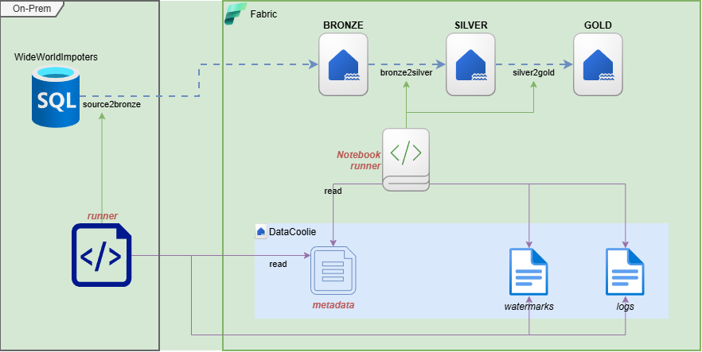
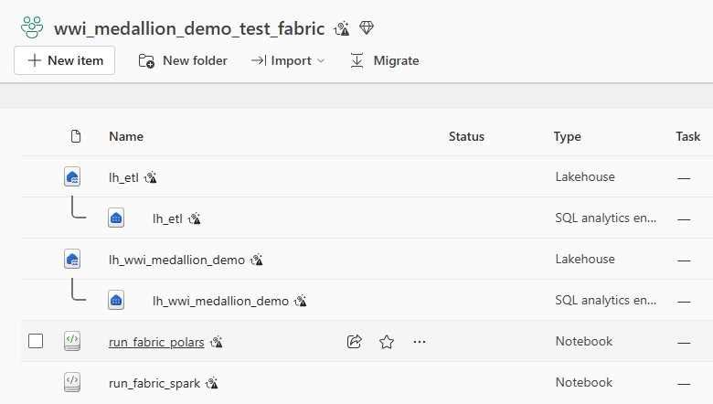
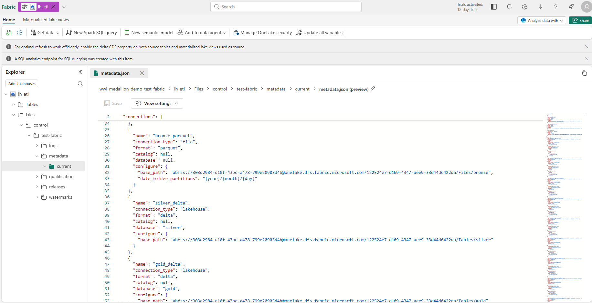
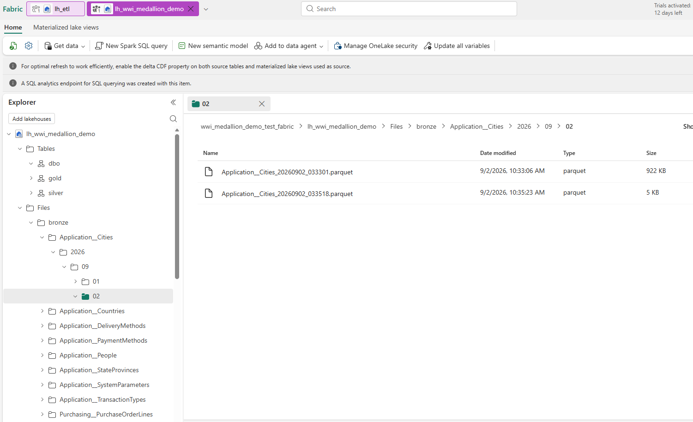
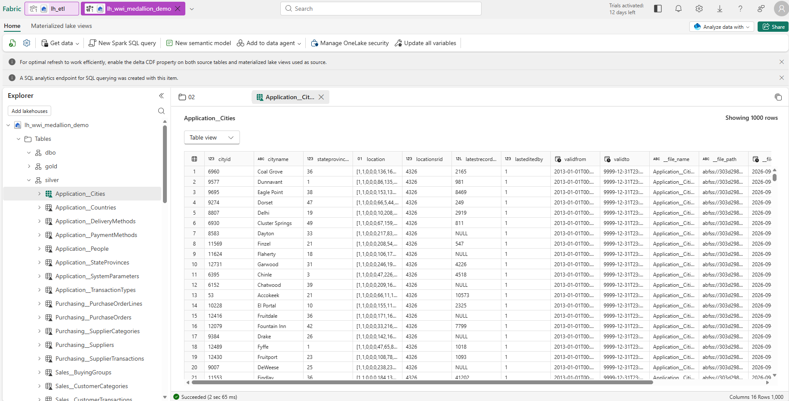
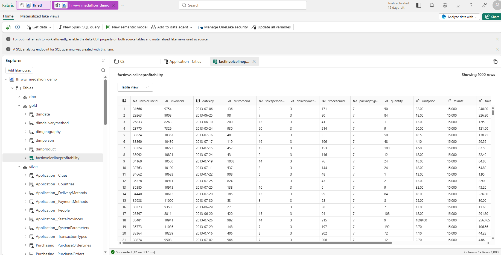
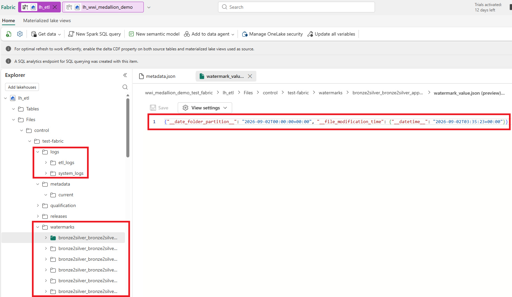
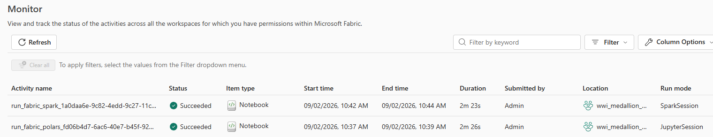

# From On-Premises SQL Server to Microsoft Fabric with a Metadata-Driven Medallion Pipeline

In this demo, I use DataCoolie to move WideWorldImporters data from an on-premises SQL Server into
Microsoft Fabric. The pipeline is driven by one `metadata.json` file and follows the Bronze,
Silver, and Gold pattern.

The focus here is the Fabric execution flow, not the earlier development process.

<!-- more -->

The complete sample is available in the [datacoolie/dc-demo-fabric repository](https://github.com/datacoolie/dc-demo-fabric).

## Architecture

The SQL Server remains on-premises, so ingestion runs from an external Polars runner. Downstream
processing runs inside Fabric:

| Stage | Runtime | Output |
|---|---|---|
| `source2bronze` | On-premises Polars | Parquet in `Files/bronze` |
| `bronze2silver` | Fabric Python 3.12 notebook with Polars and delta-rs | Delta tables in `silver` |
| `silver2gold` | Fabric Spark notebook | Delta tables in `gold` |



The workspace uses two Lakehouses:

```text
lh_wwi_medallion_demo
├── Files/bronze
├── Tables/silver
└── Tables/gold

lh_etl
└── Files/control/test-fabric
    ├── metadata/current/metadata.json
    ├── logs
    └── watermarks
```

This keeps operational state separate from business data while allowing every runtime to use the
same metadata and watermarks.



## One metadata file, three stages

The final metadata contains four connections, 68 dataflows, and shared schema hints. Each dataflow
declares its stage, source, destination, load type, watermark, merge keys, or SQL query. The runner
remains generic: it reads this file and receives only the stage name it should execute.

The Fabric environment maps logical connections to:

```text
bronze_parquet → Files/bronze
silver_delta   → Tables/silver
gold_delta     → Tables/gold
```


Note: An AI agent will assist in generating the metadata.json file.

## Uploading the artifacts with Fabric CLI

After creating the two Lakehouses, install the Fabric CLI, authenticate, upload the metadata, and
import the two notebooks:

```powershell
pip install --upgrade ms-fabric-cli
fab auth login

$workspace = 'wwi_medallion_demo_test_fabric.Workspace'
$etl = "$workspace/lh_etl.Lakehouse"

fab mkdir "$etl/Files/control/test-fabric/metadata/current"
fab cp '.\metadata.json' `
  "$etl/Files/control/test-fabric/metadata/current/metadata.json" -f

fab import "$workspace/run_fabric_polars.Notebook" `
  -i '.\runners\run_fabric_polars.ipynb' --format ipynb -f
fab import "$workspace/run_fabric_spark.Notebook" `
  -i '.\runners\run_fabric_spark.ipynb' --format ipynb -f
```


## Stage 1: SQL Server to Bronze

The on-premises runner reads 31 business tables and appends raw Parquet batches to OneLake. Every
table has a watermark: `ValidFrom`, `LastEditedWhen`, or `VehicleTemperatureID`. Timestamp-based
flows reread a one-day overlap to reduce the chance of missing late records.

Bronze files are organized by ingestion date:

```text
Files/bronze/<schema>__<table>/YYYY/MM/DD/
```

This stage still runs on-premises because it requires SQL Server connectivity:

```powershell
$control = 'abfss://wwi_medallion_demo_test_fabric@onelake.dfs.fabric.microsoft.com/lh_etl.Lakehouse/Files/control/test-fabric'

python '.\runners\run_fabric_polars_azure_sdk.py' `
  --metadata-path "$control/metadata/current/metadata.json" `
  --watermark-base-path "$control/watermarks" `
  --log-base-path "$control/logs" `
  --stage source2bronze --max-workers 4
```



## Stage 2: Bronze to Silver

A Fabric Python notebook runs this stage with Polars and delta-rs, without Spark. It reads new
Bronze files through `__file_modification_time`, removes duplicate source keys, and performs a
Delta `merge_upsert` for all 31 tables.

The result is a current-state Silver replica while Bronze keeps the raw append history.

After Bronze is ready, start the notebook with Fabric CLI. The Lakehouse configuration binds the
notebook to `lh_wwi_medallion_demo`:

```powershell
$lakehouseConfig = '{"defaultLakehouse":{"name":"lh_wwi_medallion_demo","id":"<lakehouse-id>","workspaceId":"<workspace-id>"}}'

fab job run "$workspace/run_fabric_polars.Notebook" `
  -P "STAGE:string=bronze2silver,_inlineInstallationEnabled:bool=true" `
  -C $lakehouseConfig --timeout 3600
```



## Stage 3: Silver to Gold

The final stage runs in a Fabric Spark notebook. SQL queries stored in metadata read two-level names
such as `silver.Sales__InvoiceLines` and create six Gold products:

- `DimDate`
- `DimGeography`
- `DimProduct`
- `DimPerson`
- `DimDeliveryMethod`
- `FactInvoiceLineProfitability`

The source instance had no customer data, so customer-dependent Gold models were intentionally
excluded.

Run Gold only after the Silver notebook succeeds:

```powershell
fab job run "$workspace/run_fabric_spark.Notebook" `
  -P "STAGE:string=silver2gold,_inlineInstallationEnabled:bool=true" `
  -C $lakehouseConfig --timeout 3600
```



## Monitoring the complete flow

Fabric Monitoring shows notebook status, duration, and execution details. DataCoolie writes
dataflow-level logs and watermarks to `lh_etl`, allowing DataCoolie Studio to display metadata,
assets, lineage, jobs, and individual dataflow runs across all three stages.





## Result

The completed pipeline has 31 incremental Bronze flows, 31 key-merged Silver tables, and six Gold
products. The runner stays generic; metadata defines the tables, watermarks, merge keys, paths, and
SQL transformations.

This separation makes the pipeline easier to extend and keeps the hybrid on-premises/Fabric
workflow observable as one system.

## Further reading

- [Connect to Microsoft OneLake](https://learn.microsoft.com/en-us/fabric/onelake/onelake-access-api)
- [Lakehouse schemas in Microsoft Fabric](https://learn.microsoft.com/en-us/fabric/data-engineering/lakehouse-schemas)
- [Microsoft Fabric command-line interface](https://learn.microsoft.com/en-us/rest/api/fabric/articles/fabric-command-line-interface)
