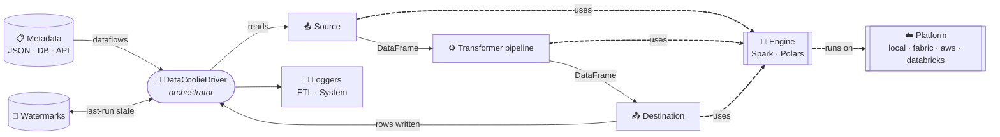
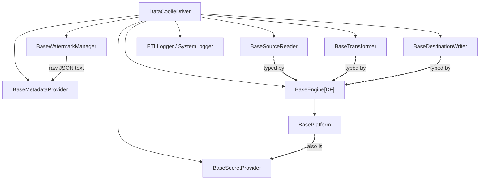
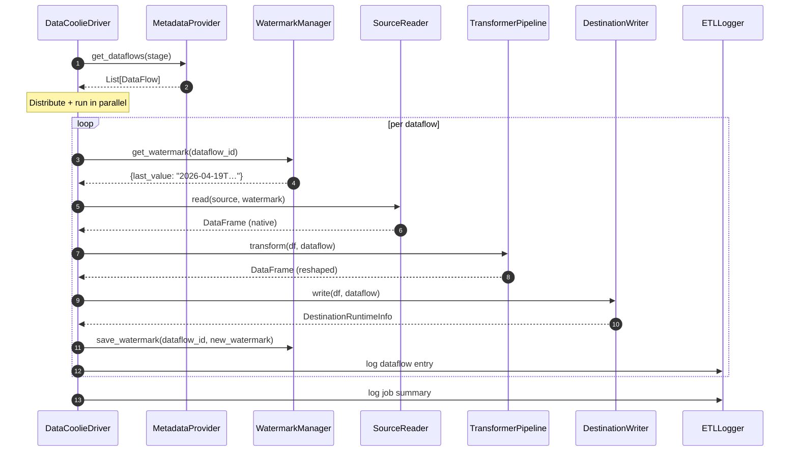

# Architecture

**TL;DR** Think of DataCoolie as a **conductor** (the `DataCoolieDriver`) and an
**orchestra of swappable musicians** (plugins). The conductor reads sheet music
(metadata), tells each musician when to play, and writes the recording
(watermarks + logs). Every musician implements a single abstract base class and
is discovered through Python **entry points** — swap one out without touching
the conductor.

## The mental model



- **Solid arrows** = data flow.
- **Dashed arrows** = "uses / delegates to".
- The **engine** is the only box that knows what a DataFrame *is*; the
  **platform** is the only box that knows what a *filesystem* is.

## The eight roles

| # | Role | Base class | What it decides | Example plugins |
|---|------|------------|-----------------|-----------------|
| 1 | **Metadata provider** | `BaseMetadataProvider` | *Where do dataflow definitions live?* | `file`, `database`, `api` |
| 2 | **Watermark manager** | `BaseWatermarkManager` | *How do we remember where we left off?* | `WatermarkManager` (wraps any metadata provider) |
| 3 | **Engine** | `BaseEngine[DF]` | *What computes the DataFrame?* | `spark`, `polars` |
| 4 | **Platform** | `BasePlatform` | *Where do files, tables, and secrets live?* | `local`, `fabric`, `aws`, `databricks` |
| 5 | **Source reader** | `BaseSourceReader` | *How do we load this format into a DataFrame?* | `delta`, `iceberg`, `csv`, `sql`, `api`, … |
| 6 | **Transformer** | `BaseTransformer` | *How do we shape the DataFrame before writing?* | `schema_converter`, `deduplicator`, `scd2_column_adder`, … |
| 7 | **Destination writer** | `BaseDestinationWriter` | *How do we persist the DataFrame?* | `delta`, `iceberg`, `parquet`, … |
| 8 | **Secret provider** | `BaseSecretProvider` | *Where do connection secrets come from?* | platform-native providers via `local`, `fabric`, `aws`, `databricks` |

Secret resolvers (`BaseSecretResolver`) are companion syntax adapters around
that provider layer, not a ninth execution role. See [Secrets](secrets.md) and
[ADR-0002](../adr/0002-secret-provider-resolver-split.md).

## Who depends on whom

One rule keeps this simple:

> **Plugins depend on *abstract bases only*. They never import each other.**



Key invariants:

- **Driver ↔ bases only** — never imports `SparkEngine`, `DeltaSourceReader`,
  etc.
- **Engine owns the platform** — `engine.platform.list_files(...)` is the *only* way
  plugins touch the filesystem.
- **Secret provider is abstract too** — `DataCoolieDriver` accepts an explicit
  `secret_provider`; otherwise it falls back to `engine.platform` because
  `BasePlatform` subclasses `BaseSecretProvider`.
- **Sources, transformers, destinations are typed by engine**, so
  `mypy --strict` rejects e.g. a Polars DataFrame passed to a Spark writer.
- **Watermark manager wraps the metadata provider** — provider returns raw JSON
  text, manager parses `Dict[str, Any]`. See
  [ADR-0004](../adr/0004-raw-json-watermark-contract.md).

## Runtime flow (one dataflow)



Inside the driver, three helpers split the work:

- **`JobDistributor`** — given `(job_num, job_index)`, keeps only the slice of
  dataflows this worker owns. Lets you shard a run across N pods.
- **`ParallelExecutor`** — runs that slice concurrently up to `max_workers`.
- **`RetryHandler`** — wraps each dataflow with configurable retries/backoff.

## Why `BaseEngine[DF]` is generic

`BaseEngine` is parameterised by `DF`, the *native* DataFrame type:

| Engine | `DF` binds to | Why it matters |
|---|---|---|
| `SparkEngine` | `pyspark.sql.DataFrame` | `mypy --strict` sees Spark-only methods (`.withColumn`, …) |
| `PolarsEngine` | `polars.DataFrame` | `mypy --strict` sees Polars-only methods (`.with_columns`, …) |

Sources, destinations, and transformers carry the same `DF` parameter — so
mixing a Polars source with a Spark destination is a **compile-time error**,
not a 2 AM runtime crash.

The `fmt=` parameter on engine methods (`read_table(fmt="delta")`,
`merge_to_table(..., fmt="iceberg")`, `table_exists_by_name(*, fmt="delta")`)
unifies Delta Lake and Apache Iceberg at the engine level. See
[Engines](engines.md) and [ADR-0001](../adr/0001-engine-fmt-parameter.md).

## Plugin boundary: how swap-ability actually works

Every role has a global registry declared in
[`datacoolie/__init__.py`](https://github.com/datacoolie/datacoolie/blob/main/datacoolie/src/datacoolie/__init__.py):

```python
engine_registry:      PluginRegistry[BaseEngine]      = PluginRegistry("datacoolie.engines", BaseEngine)
platform_registry:    PluginRegistry[BasePlatform]    = PluginRegistry("datacoolie.platforms", BasePlatform)
source_registry:      PluginRegistry[BaseSourceReader]      = PluginRegistry("datacoolie.sources", BaseSourceReader)
destination_registry: PluginRegistry[BaseDestinationWriter] = PluginRegistry("datacoolie.destinations", BaseDestinationWriter)
transformer_registry: PluginRegistry[BaseTransformer] = PluginRegistry("datacoolie.transformers", BaseTransformer)
resolver_registry:    PluginRegistry[BaseSecretResolver]    = PluginRegistry("datacoolie.resolvers", BaseSecretResolver)
```

Secret providers are typically supplied by platforms, so there is no separate
provider registry. Resolver plugins extend placeholder syntaxes; the provider
role is satisfied by the active platform unless you inject a different
`BaseSecretProvider` into the driver.

A `PluginRegistry` is lazy: on the first `.get("spark")` call it scans the
matching **`pyproject.toml` entry-point group** (`datacoolie.engines`, …) and
imports only that one plugin. A third-party package can ship a plugin by
declaring:

```toml
[project.entry-points."datacoolie.engines"]
duckdb = "my_pkg.duckdb_engine:DuckDbEngine"
```

…with no import of `datacoolie` at install time. See
[Plugin entry points](../reference/plugin-entry-points.md) for the full
generated table.
