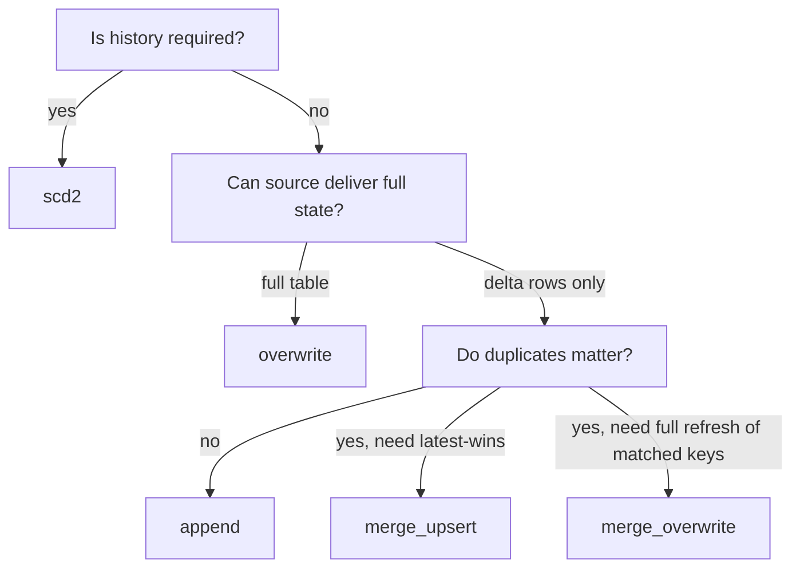

# Load strategies

**TL;DR** `destination.load_type` selects one of five strategies: `append`,
`overwrite` (aka `full_load`), `merge_upsert`, `merge_overwrite`, `scd2`. Each
maps onto a specific `BaseEngine` method.

## Strategy matrix

| `load_type` | Engine method | Touches existing rows? | Keys required | Typical use |
|---|---|---|---|---|
| `append` | `write_to_*(mode="append")` | no | — | Event streams, fact tables where duplicates are acceptable. |
| `overwrite` / `full_load` | `write_to_*(mode="overwrite")` | replaces everything | — | Daily snapshot dims, aggregates. |
| `merge_upsert` | `merge_to_*` | updates matched, inserts unmatched | `merge_keys` | Incremental CDC-style loads. |
| `merge_overwrite` | `merge_overwrite_to_*` | deletes matched rows then reinserts from source | `merge_keys` | "Rolling overwrite" when source always holds full current-state for a window. |
| `scd2` | `scd2_*` | closes out matched, inserts new version | `merge_keys` | Slowly-changing dimensions with history. |

!!! info "`full_load` vs `overwrite`"
    Same semantics. `full_load` is kept for metadata authored before the enum
    was consolidated.

## `merge_upsert` (SCD1 / CDC)

Standard upsert: rows with matching `merge_keys` are **updated**, rows without
a match are **inserted**. Nothing is deleted.

```json
"destination": {
  "load_type": "merge_upsert",
  "merge_keys": ["customer_id"]
}
```

## `merge_overwrite` (rolling overwrite)

Used when the source always holds the *current state* for a set of keys and you
want to replace the destination rows for those keys. Existing rows matching
`merge_keys` are **deleted** and re-inserted from the source.

Example: nightly snapshot of "last 7 days" — everything older is already final;
everything inside the window is delivered fresh.

## `scd2` (Type 2 with history)

`SCD2ColumnAdder` (order 60) reads the metadata-declared
`destination.configure.scd2_effective_column` (a source business-time column) and adds
three framework columns before write:

- `__valid_from` — copied from the effective column
- `__valid_to` — initially NULL
- `__is_current` — initially `true`

The engine's `scd2_to_path` / `scd2_to_table` then runs a two-step MERGE:

1. **Close step** — for every source row whose `merge_keys` match a target row
   where `__is_current = true` *and* the source `__valid_from` is later than
   the target `__valid_from` (late-arrival guard), set
   `__valid_to = source.__valid_from` and `__is_current = false`.
2. **Append step** — insert all source rows as new versions.

No hash column is stored; versioning is driven entirely by the effective-date
column you nominate. See [How-to · Merge & SCD2](../how-to/merge-and-scd2.md)
for a worked example.

## Choosing a strategy



## Related

- [ADR-0001 · Engine `fmt=` parameter](../adr/0001-engine-fmt-parameter.md)
- [`reference/api/destinations`](../reference/api/destinations.md)
