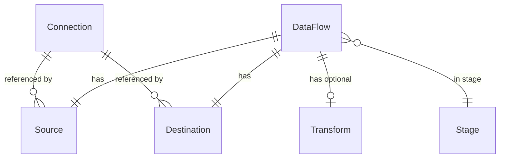

# Metadata model

**TL;DR** DataCoolie is driven by four top-level models — `Connection`,
`DataFlow` (with nested `Source`, `Destination`, `Transform`), and
`DataCoolieRunConfig`. All are `CompatModel`-backed dataclasses from
`datacoolie.core.models`.

## Mental model

Connections are **shared** (used by many dataflows); sources, destinations, and
transforms are **dataflow-scoped**.

## Top level

### `DataCoolieRunConfig`

Execution parameters independent of any single dataflow: `job_id`, `job_num`,
`job_index`, `max_workers`, `retry_count`, `retry_delay`, `stop_on_error`,
`dry_run`. The driver creates one of these per invocation.

### `Connection`

An *endpoint*: file root, lakehouse path, RDBMS, or REST API.

- `name` (required, used as the `connection_id` via `name_to_uuid`)
- `connection_type` (`file`, `lakehouse`, `database`, `api`, `function`, `streaming`)
- `format` (`parquet`, `delta`, `iceberg`, `csv`, `json`, `jsonl`, `avro`, `excel`, `sql`, `api`, `function`)
- `configure` — **a JSON object** of type-specific settings (`base_path`, `host`, `port`, `read_options`, `write_options`, `url`, `driver`, …)
- `secrets_ref` — `{vault_source: [field, …]}` map (see [Secrets](secrets.md))
- `is_active` — boolean toggle

Model validation **cross-checks** `format` against `connection_type` using
`CONNECTION_TYPE_FORMATS`. If you omit `connection_type` it is derived from the
`format`.

### `DataFlow`

One logical ETL unit. Fields:

- `name`, `stage` (free-form string; any filter passed to `driver.run(stage=…)` matches exactly)
- `source`, `destination`, `transform` (nested models)
- `is_active`

Computed properties: `deduplicate_columns` (from `transform.deduplicate_column_names(merge_keys)`), `order_columns` (from `transform.latest_data_columns` or `source.watermark_columns`).

### `Source`, `Destination`

Reference a connection by name plus:

- `schema_name`, `table` — used to build the path (`{base_path}/{schema_name}/{table}`) or the qualified name (`` `catalog`.`database`.`schema`.`table` ``)
- source-only: `watermark_columns` — list of column names used for incremental reads
- destination-only: `load_type` (`append` / `overwrite` / `merge_upsert` / `merge_overwrite` / `scd2`), `merge_keys`, `partition_columns`

### `Transform`

- `deduplicate_columns` — list of key column names for deduplication (maps to `Deduplicator`)
- `latest_data_columns` — columns used to pick the latest row when deduplicating
- `additional_columns` — list of `{column, expression}` for computed columns
- `schema_hints` — list of `SchemaHint` rows applied by the `SchemaConverter`
- `configure` — arbitrary JSON options passed through to transformers

See [Transformers & pipeline](transformers-and-pipeline.md) for how these map
onto transformer instances.

## Why `configure` (JSON blob) instead of a flat schema?

Each connection type has a different set of options — `read_options` on a file,
`url` and `driver` on a database, `endpoint` and `pagination` on an API. A flat
column per option would balloon the schema and break every time a new option is
added.

Instead, **`configure` is a typed JSON object** stored as text in the DB
provider, a raw dict in the file provider, and serialised by the API provider.
Properties surface the most-used values
(`base_path`, `host`, `port`, `url`, `driver`, `read_options`, `write_options`)
as first-class attributes so callers don’t need to dig into the dict.

!!! info "Naming: `configure`, not `config`"
    The persistent column and field are named `configure`, not `config`.
    The verb form avoids conflicts with framework internals.

## Backward-compat lifts

When `configure` contains `catalog` or `database`, model initialization lifts
them to first-class `Connection.catalog` / `Connection.database` attributes so
old metadata keeps working. Call `connection.refresh_from_configure()` after
secret resolution to pick up resolved values.

## Reference

- Fully field-by-field: [Reference · Metadata schema](../reference/metadata-schema.md)
  (auto-generated from the `datacoolie.core.models` types on every build).
- How to author metadata in each backend:
  [file](../how-to/configure-file-metadata.md) · [database](../how-to/configure-database-metadata.md) · [API](../how-to/configure-api-metadata.md).
