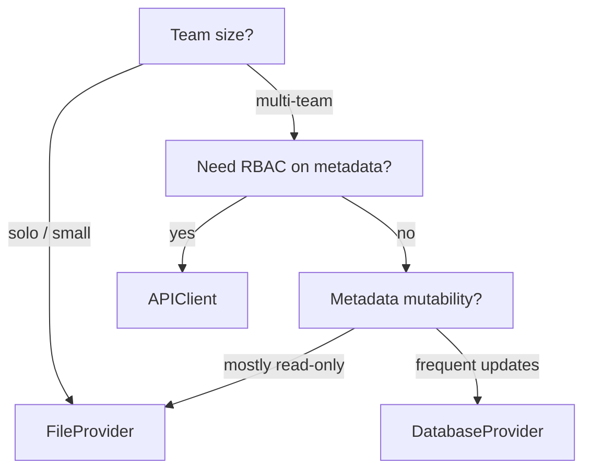

# Metadata providers

**TL;DR** Pick `FileProvider` for small fixed projects, `DatabaseProvider` for
shared team metadata, `APIClient` when you already run a metadata
service. All three implement the same `BaseMetadataProvider` contract, so you
can swap them without changing pipeline code.

## The contract

`BaseMetadataProvider` exposes:

- `get_connections()` / `get_connection_by_name(name)`
- `get_dataflows(stage=..., active_only=True, attach_schema_hints=True)`
- `get_watermark(dataflow_id: str) -> Optional[str]` — raw JSON, not parsed
- `update_watermark(dataflow_id, watermark_value, *, job_id, dataflow_run_id)`

The raw-JSON return of `get_watermark` is intentional — `WatermarkManager` does
the deserialisation so providers don't need to depend on datetime handling.
See [Watermarks](watermarks.md) and [ADR-0004](../adr/0004-raw-json-watermark-contract.md).

## Built-ins

| Provider | Backend | Install | Good for |
|---|---|---|---|
| `FileProvider` | JSON · YAML · Excel | core + `[excel]` for .xlsx | Small projects, SCM-versioned metadata, demos |
| `DatabaseProvider` | Any SQLAlchemy dialect | `[db]` | Multi-team, mutable metadata, centralised governance |
| `APIClient` | REST | `[api]` | Existing metadata service, RBAC on metadata |

## File provider

- Canonical source is **JSON**; YAML and Excel are generated equivalents.
- One file per use case is the convention (`orders_csv_to_parquet.{json,yaml,xlsx}`).
- Blank `is_active` in Excel means **unset** (not `False`). Generators preserve this nuance.
- Watermarks default to `{config_dir}/watermarks/{stage}_{name}_{dataflow_id}/watermark.json`.
  If `stage` or `name` is missing, the folder falls back to `{dataflow_id}`.

## Database provider

- SQLAlchemy tables: `dc_framework_connections`, `dc_framework_dataflows`,
  `dc_framework_watermarks`, `dc_framework_schema_hints`.
- All tables are workspace-scoped (`workspace_id` column) and honour soft-delete
  (`deleted_at IS NULL`).
- Concurrency-safe writes: `DatabaseProvider` opens one short-lived connection
  per operation and does not hold a session across `run()` boundaries.

## API provider

- Client calls a REST service whose OpenAPI contract is published by
  `usecase-sim/docker/pg_api_metadata_server.py` as a reference implementation.
- All endpoints are scoped under `/workspaces/{workspace_id}/`.
- Read-through cache can be enabled via `enable_cache=True` (the default) to avoid
  hammering the service during parallel execution.

## Picking a provider

## Related

- [How-to · Configure file metadata](../how-to/configure-file-metadata.md)
- [How-to · Configure database metadata](../how-to/configure-database-metadata.md)
- [How-to · Configure API metadata](../how-to/configure-api-metadata.md)
- [`reference/api/metadata`](../reference/api/metadata.md)
