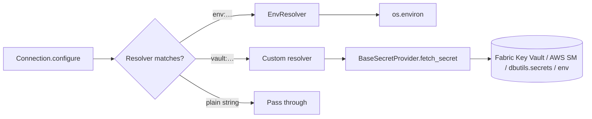

# Secrets

**TL;DR** DataCoolie has **two** secret interfaces: `BaseSecretProvider`
(fetches secrets from a backend) and `BaseSecretResolver` (resolves
placeholder strings inside a `Connection.configure` dict). The platform is
the default provider; resolvers are per-syntax (`env:FOO_PASSWORD`, `vault:…`).

## Provider vs resolver



- **Provider** (`BaseSecretProvider`) = **where** secrets live.
  Each platform is a native provider by subclassing `BasePlatform`, so every
  platform brings its own secret backend:
  Local uses `os.environ`, Fabric uses Azure Key Vault through
  `notebookutils.credentials`, Databricks uses `dbutils.secrets`, and AWS uses
  AWS Secrets Manager.
- **Resolver** (`BaseSecretResolver`) = **how** to interpret a placeholder
  string. Built-in `EnvResolver` handles `env:VAR_NAME`; you can add more.

This split means a third-party plugin can define its own placeholder syntax
without caring about the vault backend, and vice versa. See
[ADR-0002](../adr/0002-secret-provider-resolver-split.md).

## `secrets_ref` schema

`Connection.secrets_ref` maps each secret source to the `configure` fields that
should be resolved from that source. Each listed field must already exist in
`configure`, and its current value must be the vault key or secret name to look
up:

```json
{
  "configure": {
    "host": "db.internal",
    "port": 5432,
    "username": "db-user-secret",
    "password": "db-password-secret"
  },
  "secrets_ref": {
    "keyvault": ["password"],
    "env": ["username"]
  }
}
```

At resolve time DataCoolie:

1. For each `source`, for each `field`: fetch the secret value from the
  provider and **replace** `configure[field]` with the resolved value.
2. Calls `connection.refresh_from_configure()` so first-class attributes
   (`database`, `catalog`) pick up resolved values.

If a field is listed in `secrets_ref` but missing from `configure`, DataCoolie
raises an error instead of guessing where the secret should be written.

Constraint: **a `field` must appear under exactly one `source`**. Listing the
same field under two sources is ambiguous and raises `ConfigurationError`.

## Built-in resolvers

Only one: `EnvResolver` for `env:*` lookups. Register more via the
`datacoolie.resolvers` entry-point group.

## `SecretStr` — Opaque secret wrapper

Resolved secret values are wrapped in `SecretStr`, an opaque object that
**prevents accidental exposure** through `str()`, `repr()`, `print()`,
f-strings, and tracebacks.  All public representations render `***`.

There is **no** public method to extract the underlying string.  Framework
internals use two private helpers at I/O boundaries:

| Helper | Purpose |
|--------|---------|
| `unwrap_secret(value)` | Extract the raw `str` from a `SecretStr` (identity for plain strings) |
| `unwrap_configure(configure)` | Deep-copy a configure dict, unwrapping all `SecretStr` values |

This replaces the earlier `SensitiveValueFilter` log filter approach.  Instead
of scrubbing secrets from log messages after the fact, the framework now
ensures secrets **never reach** log formatters in the first place.

!!! warning "Extension authors"
    If your plugin receives a `Connection.configure` dict, call
    `unwrap_configure(configure)` before passing values to external clients
    (HTTP auth, JDBC connection strings, etc.).  The wrapped values will not
    work as raw strings.

## Built-in providers

All four platforms. `AWSPlatform._fetch_secret` goes to AWS Secrets Manager;
`FabricPlatform` uses `notebookutils.credentials`; `DatabricksPlatform` uses
`dbutils.secrets`; `LocalPlatform` reads `os.environ`.

## Related

- [ADR-0002 · Secret provider / resolver split](../adr/0002-secret-provider-resolver-split.md)
- [Writing a secret resolver](../extending/writing-a-secret-resolver.md)
