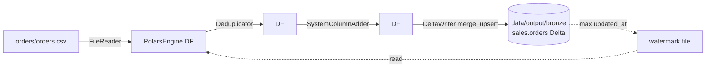

# Quickstart · Polars

Run a full DataCoolie pipeline on your laptop in under five minutes. No Docker,
no JVM, no cloud account.

**Prerequisites**

- Python 3.11+
- `pip install "datacoolie[polars,deltalake]"`

**End state**

- A CSV read from disk
- Transformed (deduplicated, system columns added)
- Written as a Delta table
- With a watermark recorded for the next incremental run

## 1. Create a workspace

```bash
mkdir dc-quickstart && cd dc-quickstart
mkdir -p data/input/orders data/output metadata
```

## 2. Seed input data

`data/input/orders/orders.csv`:

```csv
order_id,customer_id,amount,updated_at
1,42,19.99,2026-04-01T10:00:00
2,42,29.00,2026-04-02T11:30:00
2,42,29.00,2026-04-02T11:30:00
3,17,5.50,2026-04-03T09:15:00
```

## 3. Write metadata

`metadata/orders.json`:

```json
{
  "connections": [
    {
      "name": "local_input",
      "connection_type": "file",
      "format": "csv",
      "configure": {"base_path": "data/input"}
    },
    {
      "name": "local_bronze",
      "connection_type": "lakehouse",
      "format": "delta",
      "configure": {"base_path": "data/output/bronze"}
    }
  ],
  "dataflows": [
    {
      "name": "orders_to_bronze",
      "stage": "ingest2bronze",
      "source": {
        "connection": "local_input",
        "table": "orders",
        "watermark_columns": ["updated_at"]
      },
      "destination": {
        "connection": "local_bronze",
        "schema_name": "sales",
        "table": "orders",
        "load_type": "merge_upsert",
        "merge_keys": ["order_id"]
      },
      "transform": {
        "deduplicate_columns": ["order_id"],
        "latest_data_columns": ["updated_at"]
      }
    }
  ]
}
```

## 4. Run it

`run.py`:

```python
from datacoolie.engines.polars_engine import PolarsEngine
from datacoolie.platforms.local_platform import LocalPlatform
from datacoolie.metadata.file_provider import FileProvider
from datacoolie.orchestration.driver import DataCoolieDriver

platform = LocalPlatform()
engine = PolarsEngine(platform=platform)
metadata = FileProvider(config_path="metadata/orders.json", platform=platform)

with DataCoolieDriver(engine=engine, metadata_provider=metadata) as driver:
    result = driver.run(stage="ingest2bronze")

print(f"succeeded={result.succeeded} failed={result.failed}")
```

```bash
python run.py
```

Expected:

```text
succeeded=1 failed=0
```

## 5. Inspect the output

```python
import polars as pl
df = pl.read_delta("data/output/bronze/sales/orders")
print(df)
```

You should see **3 rows** (not 4 — the duplicate `order_id=2` was deduplicated
by `updated_at desc`) plus framework columns like `__<column_name>`.

## 6. Run it again (incremental)

Append a new row to `data/input/orders/orders.csv`:

```csv
4,99,12.00,2026-04-04T08:00:00
```

Re-run `python run.py`. Only the new row is picked up — the watermark on
`updated_at` filters out already-processed data. Confirm:

```python
pl.read_delta("data/output/bronze/sales/orders").height  # -> 4
```

## What just happened



The framework assembled this pipeline **from metadata alone**. To ship it to
Spark on Fabric, swap two lines:

```python
from datacoolie.engines.spark_engine import SparkEngine
from datacoolie.platforms.fabric_platform import FabricPlatform

platform = FabricPlatform()
engine = SparkEngine(spark_session=spark, platform=platform)
```

## Next

- [Quickstart · Spark](quickstart-spark.md) — run the same pipeline on Spark with
  Delta Lake.
- [Your first dataflow](first-dataflow.md) — a longer tutorial with multiple stages.
- [Concepts · Metadata model](../concepts/metadata-model.md) — what every field in
  `metadata/orders.json` means.
- [How-to · Merge & SCD2](../how-to/merge-and-scd2.md) — other load strategies.
