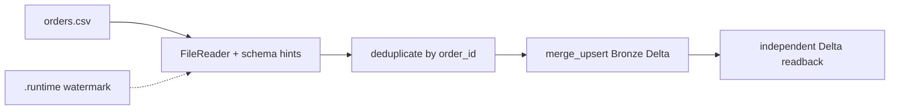

# Quickstart · Polars

This is the shortest complete local run. It uses the [canonical
project](../../examples/index.md#getting-started-project), an explicit runtime
state root and a Delta readback. Keep the extracted project in a new directory
so an old Delta schema or watermark cannot change the result.

## 1. Install and extract

Follow [Installation](installation.md) and install
`datacoolie[cli,polars-delta]`. Download the
[getting-started archive](../../examples/downloads/getting-started.zip), then
extract it. The commands below assume the current directory contains the
`getting-started/` directory:

```bash
cd getting-started
```

The source CSV has four rows, including a duplicate `order_id` 2. The metadata
declares signed 64-bit IDs, `Decimal(18,2)` amount and a timestamp watermark.
The reader captures the watermark from the source before later transforms; it
is persisted under `.runtime/` and is not inferred from the destination's max
timestamp.

## 2. Validate the project

From the directory above, run:

```bash
dc validate --env local --format json
```

The project has one required Bronze flow named `orders_to_bronze` in stage
`ingest2bronze`. Validation does not execute it.

## 3. Run the first load

```bash
python runners/local/run_polars.py --lesson orders --state-base-path .runtime
```

The runner checks the selected flow and fails the process when the required
flow is missing, failed or pending. A successful first run exits with status 0
and reports one completed flow. Read the output independently:

```python
import polars as pl

orders = (
    pl.read_delta("data/output/bronze/orders")
    .select("order_id", "customer_id", "amount")
    .sort("order_id")
)
assert orders.height == 3
assert orders.select("order_id", "customer_id").rows() == [(1, 42), (2, 42), (3, 17)]
assert orders.select(pl.col("amount").cast(pl.Float64)).to_series().to_list() == [
    19.99,
    29.0,
    5.5,
]
assert orders["order_id"].dtype == pl.Int64
assert orders["customer_id"].dtype == pl.Int64
assert orders["amount"].dtype == pl.Decimal(precision=18, scale=2)
```

Framework system columns may appear beside these business columns. The
duplicate row is removed by the declared `order_id` and `updated_at` rules.

## 4. Repeat without changing the input

Run the same command again:

```bash
python runners/local/run_polars.py --lesson orders --state-base-path .runtime
```

The process must exit 0 and the independent readback must still contain the
same three rows and types. Depending on the runtime result, the dataflow can
be reported as a successful no-op or an allowed incremental skip. Do not treat
an empty selection as success: the runner first verifies that the expected
input file exists, has the required headers and is readable, and it checks the
persisted output before accepting a no-change continuation.

## 5. Append one row

Append this line to `data/input/orders/orders.csv`:

```csv
4,99,12.00,2026-04-04T08:00:00
```

Run the command again. The output should now contain four IDs, with amount sum
`66.49` and the same declared business types:

```python
from decimal import Decimal

orders = pl.read_delta("data/output/bronze/orders").select(
    "order_id", "customer_id", "amount"
).sort("order_id")
assert orders["order_id"].to_list() == [1, 2, 3, 4]
assert orders["amount"].sum() == Decimal("66.49")
```

The persisted watermark should advance to the new source maximum. Its JSON
serialization is a reader-state detail; inspect it under `.runtime/` instead
of assuming it is a typed Delta timestamp.

## What this run proves



This proves a local Polars contract. A platform or Spark handoff still needs
its own engine/session, paths, credentials and host-specific setup; continue
to [Quickstart · Spark](quickstart-spark.md) or the [platform guides](../platforms/index.md)
for those boundaries.

The complete metadata shape is described in [Metadata model · Top
level](../../reference/concepts/metadata-model.md#top-level).

## Next

- [Quickstart · Spark](quickstart-spark.md) — execute the same metadata with Spark.
- [Use your own data](use-your-own-data.md) — choose full refresh or incremental semantics.
- [Multi-stage dataflow](multi-stage-dataflow.md) — continue these orders into Silver.
