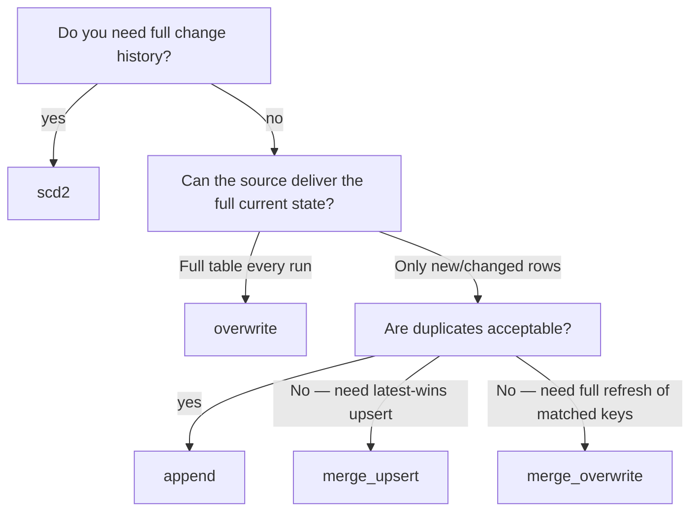

# Destination & load patterns

**Prerequisites** · A source block from [Source patterns](source-patterns.md)
and a dataflow envelope from [Dataflows](dataflows.md). Transform details are
optional for a simple load, but destination strategy can constrain them.  
**End state** · A correct `destination` block with the right `load_type` and any
required supporting fields.

The [Destination](../../reference/metadata-schema.md#destination) block decides
**where** data is written and **how** existing
data is treated. In DataCoolie, those are separate decisions:

- destination connection/format = physical target type
- `load_type` = write semantics against that target
- `partition_columns` and `write_options` = storage behavior modifiers

## Destination at a glance

```json
"destination": {
  "connection_name": "silver",
  "schema_name":     "sales",
  "table":           "orders",
  "load_type":       "merge_upsert",
  "merge_keys":      ["order_id"],
  "partition_columns": [
    { "column": "order_date", "expression": "CAST(created_at AS DATE)" }
  ],
  "configure": {
    "write_options": { "mergeSchema": true }
  }
}
```

| Field | Required | Meaning |
|-------|----------|---------|
| `connection_name` | conditional | Must match a destination connection; alternatively use inline `connection` |
| `schema_name` | no | Output namespace / folder |
| `table` | yes | Output table or folder name |
| `load_type` | no | `append`, `overwrite`, `full_load`, `merge_upsert`, `merge_overwrite`, `scd2`; defaults to `append` |
| `merge_keys` | conditional | Required for key-based merge and SCD2; a usable watermark replacement window can remove this requirement for `merge_overwrite` |
| `partition_columns` | no | Partition output by existing or derived columns |
| `configure.write_options` | no | Per-dataflow write-option overrides |
| `configure.merge_options` | no | Per-dataflow MERGE/upsert/SCD2 options; separate from append/overwrite writer options |
| `configure.scd2_effective_column` | conditional | Required for `scd2` |

`connection.configure.write_options` and `destination.configure.write_options`
are merged, with **destination overrides winning**.
The same precedence applies to `merge_options`. Keep options that control the
MERGE condition (for example `source_alias`, `target_alias`, or `predicate`) in
`merge_options`; keep file/table writer options such as schema evolution or
compression in `write_options`. A legacy merge alias placed in
`write_options` is still read for compatibility, but it is not forwarded to
the append phase.

## Which destination types are built in?

Built-in writers today support these destination families:

| Destination family | Supported formats | Addressing style | Supported load types | Maintenance |
|--------------------|-------------------|------------------|----------------------|-------------|
| Flat-file output | `parquet`, `csv`, `json`, `jsonl`, `avro` | Path-based | `append`, `overwrite`, `full_load` | No |
| Lakehouse table | `delta`, `iceberg` | Path-based or catalog/database/table | All registered load types, subject to engine/catalog support | Yes |

!!! note "What is not built in"
    - Excel is not a writable destination
    - database, API, and function destinations require custom destination plugins

## Choose your strategy first



## `append` — Add rows only, never touch existing

**When to use:** event streams, log ingestion, any scenario where duplicates in
the destination are acceptable or impossible.

```json
"destination": {
  "connection_name": "bronze",
  "schema_name":     "events",
  "table":           "clicks",
  "load_type":       "append"
}
```

No extra fields required. Every run adds the rows returned by the source.

Works for both flat-file outputs and lakehouse tables.

For flat-file destinations, each append is written as a new file whose name
contains the UTC write time and a short uniqueness suffix. This keeps rapid
replay chunks and concurrent append calls from replacing one another; readers
should scan the destination folder rather than depend on one fixed filename.

---

## `overwrite` — Replace everything

**When to use:** daily snapshots, reference tables, aggregates that are always
rebuilt from scratch.

```json
"destination": {
  "connection_name": "silver",
  "schema_name":     "sales",
  "table":           "daily_totals",
  "load_type":       "overwrite"
}
```

!!! info "`full_load` is an alias"
    `"load_type": "full_load"` is equivalent. Use `overwrite` for new
    metadata.

This is the safest whole-table strategy for file outputs. If your destination
format is `parquet`, `csv`, `json`, `jsonl`, or `avro`, `overwrite` / `full_load`
and `append` are the built-in options.

---

## `merge_upsert` — Upsert by key (SCD1 / CDC)

**When to use:** incremental CDC-style loads, dimension tables that change over
time but do not need history, customer/product master tables.

Rows matching `merge_keys` are **updated**; rows with no match are **inserted**.
Nothing is deleted.

```json
"destination": {
  "connection_name": "silver",
  "schema_name":     "sales",
  "table":           "customers",
  "load_type":       "merge_upsert",
  "merge_keys":      ["customer_id"]
}
```

| Field | Required | Notes |
|-------|----------|-------|
| `merge_keys` | **yes** | List of column names that uniquely identify a row. Can be composite: `["order_id", "line_item_id"]` |

!!! tip "Deduplication is often paired with merge_upsert"
    If your source can deliver duplicate rows for the same key, add
    `transform.deduplicate_columns` and `transform.latest_data_columns` to
    keep only the latest one before the merge. See
    [Transform patterns](transform-patterns.md).

  !!! info "First load falls back to overwrite"
    If the target table does not exist yet, DataCoolie performs an initial
    overwrite-style write and only uses merge semantics on later runs.

---

## `merge_overwrite` — Rolling overwrite by key

**When to use:** nightly snapshot that always holds the full current state for a
rolling window. Existing target rows matching `merge_keys` are **deleted** then
re-inserted from the source. A disappeared source row with no incoming key is
not deleted by this key-based path; use a complete bounded replacement window
when upstream deletions must be reflected.

```json
"destination": {
  "connection_name": "silver",
  "schema_name":     "logistics",
  "table":           "active_shipments",
  "load_type":       "merge_overwrite",
  "merge_keys":      ["shipment_id"]
}
```

!!! info "First load falls back to overwrite"
    Like `merge_upsert`, this strategy writes a brand-new table with overwrite
    semantics when the destination does not exist yet.

### `replace_by_watermark` — Range-based delete {#replace-by-watermark}

When `destination.configure.replace_by_watermark` is `true` (see
[`destination.configure`](../../reference/metadata-schema.md#dataflowsdestinationconfigure)), the
`merge_overwrite` strategy switches from **key-based delete** to
**range-based delete**: instead of deleting only rows matching `merge_keys`,
it deletes *all* target rows within the watermark window and re-inserts
the full source batch.  This handles upstream deletions that a key-match
would miss.

When the Driver has no usable replacement window, the strategy follows the
key-based path and requires `merge_keys`; `replace_by_watermark` does not invent
a window by itself. The source still needs a watermark column and an authored
look-back option for the range-based case.

Dataflow fragment for a complete source and destination combination:

```json
{
  "source": {
    "connection_name": "shipments_source",
    "table": "active_shipments",
    "watermark_columns": ["updated_at"],
    "configure": { "backward_days": 3 }
  },
  "destination": {
    "connection_name": "silver",
    "schema_name": "logistics",
    "table": "active_shipments",
    "load_type": "merge_overwrite",
    "configure": { "replace_by_watermark": true }
  }
}
```

**Requirements:**

- The source or its referenced connection **must** have an authored look-back
  option such as `backward_days` or `backward`. DataCoolie computes the effective
  `date_backward` value at runtime; do not add `date_backward` to metadata.
- Only supported with `merge_overwrite` load type.
- The source must cover the complete window, including rows deleted upstream.
- `merge_keys` is needed when the strategy falls back to key-based overwrite;
  it is not required for a usable range replacement window.

At runtime the pipeline builds an immutable, attempt-local window from the
source watermark observations (or explicit replay bounds).  The
`MergeOverwriteStrategy` passes that window to the engine's
`replace_window(...)` operation.  The engine validates the final output
columns before deleting the bounded target rows, then appends the fresh batch;
the authored dataflow metadata is never mutated.  A normal empty incremental
read skips the replacement, while a confirmed empty replay can replace its
explicit scope without creating an unrelated destination.

See the worked case, including first-run behavior and the distinction between
normal empty reads and explicit empty replay, in
[Replace a complete watermark window](watermark-window-replacement.md).
For the source-side look-back forms and connection/source precedence, see
[Incremental windows and look-back](source-patterns.md#incremental-windows-and-look-back).

---

## `scd2` — Slowly Changing Dimension Type 2

**When to use:** dimension tables where you need full change history — e.g.
`customers`, `products`, `employees` where you need to know what value was
current at any past point in time.

SCD2 stores **one row per version** of each entity. The framework automatically
adds three audit columns to every version row:

| Column | Meaning |
|--------|---------|
| `__valid_from` | When this version became current (copied from your date column) |
| `__valid_to` | When this version ended — `NULL` means it is still current |
| `__is_current` | `true` for the active version |

```json
"destination": {
  "connection_name": "gold",
  "schema_name":     "dims",
  "table":           "customer",
  "load_type":       "scd2",
  "merge_keys":      ["customer_id"],
  "configure":       { "scd2_effective_column": "updated_at" }
}
```

| Field | Required | Notes |
|-------|----------|-------|
| `merge_keys` | **yes** | The natural/business key of the entity |
| `configure.scd2_effective_column` | **yes** | The source column that timestamps when this version became effective |

!!! warning "SCD2 tables grow over time"
    Each run appends new versions for changed rows. Plan your storage and run
    [maintenance (vacuum/optimize)](../operations/maintenance.md)
    regularly.

!!! warning "Only send strictly newer versions"
    The close step ignores equal/older `scd2_effective_column` values, but the
    append step inserts every incoming row. Filter and deduplicate upstream so
    an older value cannot create a second open current version.

  !!! info "First load falls back to overwrite"
    On the first run, DataCoolie creates the destination table first and then
    switches to SCD2 versioning on subsequent runs.

When reading a stored SCD2 table, select the current version or a historical
instant explicitly. These are SQL query examples, not additional SCD2 metadata
fields:

```sql
SELECT * FROM customers_scd2 WHERE __is_current = true
```

```sql
SELECT * FROM customers_scd2
WHERE __valid_from <= CAST('2026-01-01' AS TIMESTAMP)
  AND COALESCE(__valid_to, CAST('9999-12-31' AS TIMESTAMP)) > CAST('2026-01-01' AS TIMESTAMP)
```

For an incremental source that feeds this strategy, see
[SCD2 with incremental inputs](merge-and-scd2.md).

---

## `partition_columns` — Partition the output table

Any destination strategy can optionally write partitioned data. This is not a
load type on its own — it is an addition to the destination block.
Each `partition_columns` item follows the [Partition column](../../reference/metadata-schema.md#partition-column)
shape.
For example:

```json
"destination": {
  "connection_name":   "silver",
  "schema_name":       "sales",
  "table":             "orders",
  "load_type":         "overwrite",
  "partition_columns": [
    { "column": "order_date", "expression": "CAST(created_at AS DATE)" }
  ]
}
```

`expression` is evaluated as SQL before the write. The computed column
(`order_date`) is added to the DataFrame by `PartitionHandler` (transformer
order 80) and used as the partition key.

Use the top-level `destination.partition_columns` shape for new metadata. The
model also lifts `destination.configure.partition_columns` when the top-level
field is omitted. Database-backed metadata keeps a legacy
`destination_configure.partition_by` alias for existing rows and gives that
alias precedence over `partition_columns`; do not author both forms in a new
dataflow.

Partition by an existing column — no expression needed:

```json
"partition_columns": [
  { "column": "region" }
]
```

Multi-level partitioning:

```json
"partition_columns": [
  { "column": "order_year",  "expression": "EXTRACT(YEAR FROM order_date)" },
  { "column": "order_month", "expression": "EXTRACT(MONTH FROM order_date)" }
]
```

!!! info "Partition columns extend merge keys internally"
    For merge-style destinations, DataCoolie automatically appends destination
    partition columns to the internal merge-key set when they are not already
    present. This keeps merge semantics aligned with the physical partitioning.

!!! warning "Use `CAST`, not `date(...)`, for Polars portability"
    For partition expressions, prefer `CAST(created_at AS DATE)` over
    `date(created_at)` so the metadata works in Polars as well as Spark.

### Partition expression portability

`PartitionHandler` runs at order 80, after `SystemColumnAdder` at order 70,
so expressions can use `__updated_at`, for example
`{"column": "etl_date", "expression": "CAST(__updated_at AS DATE)"}`.
Spark evaluates expressions with Spark SQL; Polars uses `pl.sql_expr`, which
supports a smaller SQL subset. Prefer `CAST(updated_at AS DATE)` over a
provider-specific `date(...)` function. For year extraction use
`EXTRACT(YEAR FROM updated_at)`. Avoid assuming `current_timestamp()` or
Java-style `date_format(..., "yyyy-MM-dd")` works in Polars; use the system
timestamp or portable `CAST` instead. Check every expression on the selected
engine before running it in another engine. Also see the
[PartitionHandler](transform-patterns.md#partitionhandler) execution order.

For merge-style writes, partition columns extend the effective merge key. If
an existing entity changes partition value, a key-based merge may not match
its old row. Choose a stable partition identity or explicitly account for
relocation; see [SCD2 with incremental inputs](merge-and-scd2.md).

---

## Flat-file outputs with date folders

Flat-file destinations have one more path-shaping option on the **connection**:

```json
{
  "name":            "curated_parquet",
  "connection_type": "file",
  "format":          "parquet",
  "configure": {
    "base_path":              "data/output/curated",
    "date_folder_partitions": "{year}/{month}/{day}"
  }
}
```

This writes under a dated subfolder such as
`data/output/curated/sales/orders/2026/05/09`.

Use this when the partitioning is based on **load time** rather than a column in
the DataFrame.

!!! note "`partition_columns` wins over `date_folder_partitions`"
    For flat-file destinations, if you configure both, DataCoolie uses
    `partition_columns` and ignores the date-folder pattern.

For `overwrite` and `full_load`, only the folder resolved for the current UTC
load time is replaced. Older dated folders remain available as immutable
snapshots; the operation does not delete the base path or sibling date folders.
`append` writes a new file in the resolved current folder.

---

## Write options

Put write-engine options at the connection level when most dataflows should use
them, and in [`destination.configure`](../../reference/metadata-schema.md#dataflowsdestinationconfigure)
when only one dataflow needs them.

Connection-level defaults:

```json
{
  "name":            "silver",
  "connection_type": "lakehouse",
  "format":          "delta",
  "configure": {
    "base_path": "data/output/silver",
    "write_options": {
      "mergeSchema": true
    }
  }
}
```

Destination-level override:

```json
"destination": {
  "connection_name": "silver",
  "schema_name":     "sales",
  "table":           "orders",
  "load_type":       "append",
  "configure": {
    "write_options": {
      "compression": "zstd"
    }
  }
}
```

### Operation-specific options

Common writer options use the Spark-style vocabulary where an equivalent
meaning is qualified for the selected engine. Native options remain available
through the same maps. Use `merge_options` for the merge phase of
`merge_upsert`, `merge_overwrite`, and `scd2`:

```json
"destination": {
  "load_type": "merge_overwrite",
  "merge_keys": ["order_id"],
  "configure": {
    "merge_options": {
      "source_alias": "incoming",
      "target_alias": "current"
    },
    "write_options": {
      "schema_mode": "merge"
    }
  }
}
```

`merge_options` are sent only to the MERGE builder. `write_options` are sent to
the append/overwrite writer, including the append phase after a merge-overwrite
or SCD2 operation. Omitted options keep the existing engine defaults; this
section does not redefine those defaults. The canonical option inventory is
still being qualified per format, operation, and engine.

Named Polars Iceberg MERGE and SCD2 operations currently have no generic
options API. Supplying non-empty `merge_options` or `write_options` for those
operations fails before mutation until a backend mapping is qualified; this
prevents an option from being silently ignored.

---

## Advanced lakehouse registration options

These options matter mostly for Delta/Iceberg deployments with metastore or AWS
catalog integration. Their connection-level shape is under
[Connection settings by endpoint type](../../reference/metadata-schema.md#connection-settings-by-endpoint-type):

| Option | Where | What it does |
|--------|-------|--------------|
| `catalog` / `database` | connection field or `configure` | Registers or addresses the destination by qualified name instead of path only |
| `athena_output_location` | `connection.configure` | After Delta writes and maintenance, registers a native Delta table through Athena DDL |
| `generate_manifest` | `connection.configure` | Generates `_symlink_format_manifest/` after writes and maintenance |
| `register_symlink_table` | `connection.configure` | Registers a Glue symlink table; implies manifest generation |
| `symlink_database_prefix` | `connection.configure` | Prefix for the generated symlink database name |

When `catalog` or `database` is present, DataCoolie identifies the physical
destination by **qualified table name**. Otherwise it identifies it by **path**.
That distinction matters for maintenance deduplication and fan-in orchestration.

### AWS Delta registration: complete prerequisites

Use the AWS registration options only when the destination is a Delta path on a
platform with the AWS integration enabled. A complete configuration includes:

```json
{
  "name": "orders_athena",
  "connection_type": "lakehouse",
  "format": "delta",
  "configure": {
    "base_path": "s3://analytics-lake/silver",
    "catalog": "AwsDataCatalog",
    "database": "analytics_silver",
    "athena_output_location": "s3://analytics-query-results/datacoolie/",
    "generate_manifest": true,
    "register_symlink_table": true
  }
}
```

The runtime must be using the AWS platform implementation, the Delta path must
resolve, and the Athena output location and target database must be available
to the configured credentials. Without those prerequisites registration is
skipped or cannot complete; a successful local file write does not prove that
the Glue/Athena catalog operation succeeded. Run a bounded smoke test and
verify the registered table separately.

---

## Maintenance support

- Flat-file destinations do **not** support maintenance.
- Delta and Iceberg destinations do.
- Maintenance is dispatched per physical destination, not per metadata row, so
  duplicate dataflows targeting the same table/path are deduplicated.

See [User guide · Maintenance (vacuum/optimize)](../operations/maintenance.md)
for the operational workflow.

---

## Common mistakes

| Symptom | Likely cause | Fix |
|---------|--------------|-----|
| `FileWriter only supports ['append', 'full_load', 'overwrite']` | Tried `merge_upsert`, `merge_overwrite`, or `scd2` on a flat-file destination | Use a Delta/Iceberg destination for merge semantics, or switch to `append` / `overwrite` |
| `merge_keys required` error | Used `merge_upsert` or `scd2` without `merge_keys` | Add `"merge_keys": ["your_key_column"]` |
| SCD2 columns not added | `scd2_effective_column` missing from `configure` | Add `"configure": { "scd2_effective_column": "updated_at" }` in destination |
| Full table replaced when you wanted upsert | `load_type` is `overwrite` instead of `merge_upsert` | Change `load_type` |
| Duplicate rows in destination after merge | Source delivers multiple rows for same key; dedup not configured | Add `transform.deduplicate_columns` — see [Transform patterns](transform-patterns.md) |
| Partition expression fails on Polars | Used `date(col)` or another unsupported SQL function | Use `CAST(col AS DATE)` or `EXTRACT(...)` |
| Maintenance skipped or fails on file outputs | Flat-file destinations do not implement maintenance | Run maintenance only on Delta/Iceberg destinations |

---

## Next

→ [Validation checklist](validation-checklist.md) · [Incremental windows and look-back](source-patterns.md#incremental-windows-and-look-back)
