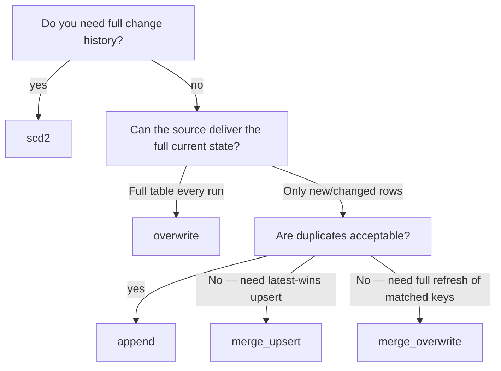

# Destination & load patterns

**Prerequisites** · Completed [Source patterns](source-patterns.md).  
**End state** · A correct `destination` block with the right `load_type` and any
required supporting fields.

The `destination` block decides **where** data is written and **how** existing
data is treated. In DataCoolie, those are separate decisions:

- destination connection/format = physical target type
- `load_type` = write semantics against that target
- `partition_columns` and `write_options` = storage behavior modifiers

## Destination at a glance

```json
"destination": {
  "connection_name": "silver",
  "schema_name":     "sales",
  "table":           "orders",
  "load_type":       "merge_upsert",
  "merge_keys":      ["order_id"],
  "partition_columns": [
    { "column": "order_date", "expression": "CAST(created_at AS DATE)" }
  ],
  "configure": {
    "write_options": { "mergeSchema": true }
  }
}
```

| Field | Required | Meaning |
|-------|----------|---------|
| `connection_name` | yes | Must match a destination connection |
| `schema_name` | no | Output namespace / folder |
| `table` | yes | Output table or folder name |
| `load_type` | yes | `append`, `overwrite`, `full_load`, `merge_upsert`, `merge_overwrite`, `scd2` |
| `merge_keys` | conditional | Required for merge and SCD2 strategies |
| `partition_columns` | no | Partition output by existing or derived columns |
| `configure.write_options` | no | Per-dataflow write-option overrides |
| `configure.scd2_effective_column` | conditional | Required for `scd2` |

`connection.configure.write_options` and `destination.configure.write_options`
are merged, with **destination overrides winning**.

## Which destination types are built in?

Built-in writers today support these destination families:

| Destination family | Supported formats | Addressing style | Supported load types | Maintenance |
|--------------------|-------------------|------------------|----------------------|-------------|
| Flat-file output | `parquet`, `csv`, `json`, `jsonl`, `avro` | Path-based | `append`, `overwrite`, `full_load` | No |
| Lakehouse table | `delta`, `iceberg` | Path-based or catalog/database/table | All load types | Yes |

!!! note "What is not built in"
    - Excel is not a writable destination
    - database, API, and function destinations require custom destination plugins

## Choose your strategy first



## `append` — Add rows only, never touch existing

**When to use:** event streams, log ingestion, any scenario where duplicates in
the destination are acceptable or impossible.

```json
"destination": {
  "connection_name": "bronze",
  "schema_name":     "events",
  "table":           "clicks",
  "load_type":       "append"
}
```

No extra fields required. Every run adds the rows returned by the source.

Works for both flat-file outputs and lakehouse tables.

---

## `overwrite` — Replace everything

**When to use:** daily snapshots, reference tables, aggregates that are always
rebuilt from scratch.

```json
"destination": {
  "connection_name": "silver",
  "schema_name":     "sales",
  "table":           "daily_totals",
  "load_type":       "overwrite"
}
```

!!! info "`full_load` is an alias"
    `"load_type": "full_load"` is equivalent. Use `overwrite` for new
    metadata.

This is the safest whole-table strategy for file outputs. If your destination
format is `parquet`, `csv`, `json`, `jsonl`, or `avro`, `overwrite` / `full_load`
and `append` are the built-in options.

---

## `merge_upsert` — Upsert by key (SCD1 / CDC)

**When to use:** incremental CDC-style loads, dimension tables that change over
time but do not need history, customer/product master tables.

Rows matching `merge_keys` are **updated**; rows with no match are **inserted**.
Nothing is deleted.

```json
"destination": {
  "connection_name": "silver",
  "schema_name":     "sales",
  "table":           "customers",
  "load_type":       "merge_upsert",
  "merge_keys":      ["customer_id"]
}
```

| Field | Required | Notes |
|-------|----------|-------|
| `merge_keys` | **yes** | List of column names that uniquely identify a row. Can be composite: `["order_id", "line_item_id"]` |

!!! tip "Deduplication is often paired with merge_upsert"
    If your source can deliver duplicate rows for the same key, add
    `transform.deduplicate_columns` and `transform.latest_data_columns` to
    keep only the latest one before the merge. See
    [Transform patterns](transform-patterns.md).

  !!! info "First load falls back to overwrite"
    If the target table does not exist yet, DataCoolie performs an initial
    overwrite-style write and only uses merge semantics on later runs.

---

## `merge_overwrite` — Rolling overwrite by key

**When to use:** nightly snapshot that always holds the full current state for a
rolling window. Existing target rows matching `merge_keys` are **deleted** then
re-inserted from the source. Unlike `merge_upsert` this handles deletions in
the source naturally.

```json
"destination": {
  "connection_name": "silver",
  "schema_name":     "logistics",
  "table":           "active_shipments",
  "load_type":       "merge_overwrite",
  "merge_keys":      ["shipment_id"]
}
```

!!! info "First load falls back to overwrite"
    Like `merge_upsert`, this strategy writes a brand-new table with overwrite
    semantics when the destination does not exist yet.

---

## `scd2` — Slowly Changing Dimension Type 2

**When to use:** dimension tables where you need full change history — e.g.
`customers`, `products`, `employees` where you need to know what value was
current at any past point in time.

SCD2 stores **one row per version** of each entity. The framework automatically
adds three audit columns to every version row:

| Column | Meaning |
|--------|---------|
| `__valid_from` | When this version became current (copied from your date column) |
| `__valid_to` | When this version ended — `NULL` means it is still current |
| `__is_current` | `true` for the active version |

```json
"destination": {
  "connection_name": "gold",
  "schema_name":     "dims",
  "table":           "customer",
  "load_type":       "scd2",
  "merge_keys":      ["customer_id"],
  "configure":       { "scd2_effective_column": "updated_at" }
}
```

| Field | Required | Notes |
|-------|----------|-------|
| `merge_keys` | **yes** | The natural/business key of the entity |
| `configure.scd2_effective_column` | **yes** | The source column that timestamps when this version became effective |

!!! warning "SCD2 tables grow over time"
    Each run appends new versions for changed rows. Plan your storage and run
    [maintenance (vacuum/optimize)](../maintenance-vacuum-optimize.md)
    regularly.

  !!! info "First load falls back to overwrite"
    On the first run, DataCoolie creates the destination table first and then
    switches to SCD2 versioning on subsequent runs.

---

## `partition_columns` — Partition the output table

Any destination strategy can optionally write partitioned data. This is not a
load type on its own — it is an addition to the destination block:

```json
"destination": {
  "connection_name":   "silver",
  "schema_name":       "sales",
  "table":             "orders",
  "load_type":         "overwrite",
  "partition_columns": [
    { "column": "order_date", "expression": "CAST(created_at AS DATE)" }
  ]
}
```

`expression` is evaluated as SQL before the write. The computed column
(`order_date`) is added to the DataFrame by `PartitionHandler` (transformer
order 80) and used as the partition key.

Partition by an existing column — no expression needed:

```json
"partition_columns": [
  { "column": "region" }
]
```

Multi-level partitioning:

```json
"partition_columns": [
  { "column": "order_year",  "expression": "EXTRACT(YEAR FROM order_date)" },
  { "column": "order_month", "expression": "EXTRACT(MONTH FROM order_date)" }
]
```

!!! info "Partition columns extend merge keys internally"
    For merge-style destinations, DataCoolie automatically appends destination
    partition columns to the internal merge-key set when they are not already
    present. This keeps merge semantics aligned with the physical partitioning.

!!! warning "Use `CAST`, not `date(...)`, for Polars portability"
    For partition expressions, prefer `CAST(created_at AS DATE)` over
    `date(created_at)` so the metadata works in Polars as well as Spark.

See [How-to · Partitioning & sanitization](../partitioning-and-sanitization.md)
for full detail.

---

## Flat-file outputs with date folders

Flat-file destinations have one more path-shaping option on the **connection**:

```json
{
  "name":            "curated_parquet",
  "connection_type": "file",
  "format":          "parquet",
  "configure": {
    "base_path":              "data/output/curated",
    "date_folder_partitions": "{year}/{month}/{day}"
  }
}
```

This writes under a dated subfolder such as
`data/output/curated/sales/orders/2026/05/09`.

Use this when the partitioning is based on **load time** rather than a column in
the DataFrame.

!!! note "`partition_columns` wins over `date_folder_partitions`"
    For flat-file destinations, if you configure both, DataCoolie uses
    `partition_columns` and ignores the date-folder pattern.

---

## Write options

Put write-engine options at the connection level when most dataflows should use
them, and at the destination level when only one dataflow needs them.

Connection-level defaults:

```json
{
  "name":            "silver",
  "connection_type": "lakehouse",
  "format":          "delta",
  "configure": {
    "base_path": "data/output/silver",
    "write_options": {
      "mergeSchema": true
    }
  }
}
```

Destination-level override:

```json
"destination": {
  "connection_name": "silver",
  "schema_name":     "sales",
  "table":           "orders",
  "load_type":       "append",
  "configure": {
    "write_options": {
      "compression": "zstd"
    }
  }
}
```

---

## Advanced lakehouse registration options

These options matter mostly for Delta/Iceberg deployments with metastore or AWS
catalog integration:

| Option | Where | What it does |
|--------|-------|--------------|
| `catalog` / `database` | connection field or `configure` | Registers or addresses the destination by qualified name instead of path only |
| `athena_output_location` | `connection.configure` | After Delta writes and maintenance, registers a native Delta table through Athena DDL |
| `generate_manifest` | `connection.configure` | Generates `_symlink_format_manifest/` after writes and maintenance |
| `register_symlink_table` | `connection.configure` | Registers a Glue symlink table; implies manifest generation |
| `symlink_database_prefix` | `connection.configure` | Prefix for the generated symlink database name |

When `catalog` or `database` is present, DataCoolie identifies the physical
destination by **qualified table name**. Otherwise it identifies it by **path**.
That distinction matters for maintenance deduplication and fan-in orchestration.

---

## Maintenance support

- Flat-file destinations do **not** support maintenance.
- Delta and Iceberg destinations do.
- Maintenance is dispatched per physical destination, not per metadata row, so
  duplicate dataflows targeting the same table/path are deduplicated.

See [How-to · Maintenance (vacuum/optimize)](../maintenance-vacuum-optimize.md)
for the operational workflow.

---

## Common mistakes

| Symptom | Likely cause | Fix |
|---------|--------------|-----|
| `FileWriter only supports ['append', 'full_load', 'overwrite']` | Tried `merge_upsert`, `merge_overwrite`, or `scd2` on a flat-file destination | Use a Delta/Iceberg destination for merge semantics, or switch to `append` / `overwrite` |
| `merge_keys required` error | Used `merge_upsert` or `scd2` without `merge_keys` | Add `"merge_keys": ["your_key_column"]` |
| SCD2 columns not added | `scd2_effective_column` missing from `configure` | Add `"configure": { "scd2_effective_column": "updated_at" }` in destination |
| Full table replaced when you wanted upsert | `load_type` is `overwrite` instead of `merge_upsert` | Change `load_type` |
| Duplicate rows in destination after merge | Source delivers multiple rows for same key; dedup not configured | Add `transform.deduplicate_columns` — see [Transform patterns](transform-patterns.md) |
| Partition expression fails on Polars | Used `date(col)` or another unsupported SQL function | Use `CAST(col AS DATE)` or `EXTRACT(...)` |
| Maintenance skipped or fails on file outputs | Flat-file destinations do not implement maintenance | Run maintenance only on Delta/Iceberg destinations |

---

## Next

→ [Transform patterns](transform-patterns.md)
