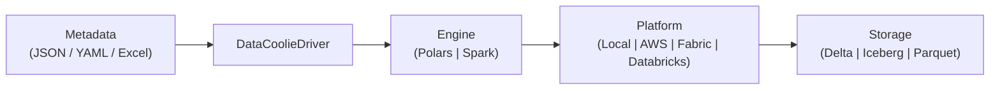

<p align="center">
  <picture>
    <source srcset="images/banners/datacoolie-banner-dark.webp" type="image/webp">
    
  </picture>
</p>


# DataCoolie — Metadata-Driven ETL Framework for Python

> Metadata-driven ETL framework — engine-unified, cloud-agnostic, batch-first.

DataCoolie exists to stop ETL pipelines from being rewritten every time the
engine, platform, or operating environment changes. Instead of maintaining
separate local scripts, Spark jobs, and cloud-specific glue code, teams
describe pipeline intent once as **metadata** (JSON / YAML / Excel / database /
REST API) and execute it on the engine and platform they need.

That helps in four practical ways:

- **Metadata-driven** — connections, dataflows, transforms, schema hints,
    partitions, and load strategies stay declarative.
- **Efficient for small and medium jobs** — lighter runtimes like Polars or
    local execution can avoid cluster overhead when scale does not require
    Spark.
- **Portable** — the same metadata can move to Spark on Fabric, Databricks, or
    AWS when workloads grow.
- **Consistent operations** — watermarks, logging, maintenance, and load
    behavior follow the same model across environments.




## Who is DataCoolie for?

- **Data Engineers** — build and operate ETL pipelines across engines and clouds
- **Analytics Engineers** — define transforms and load strategies declaratively
- **Platform / DataOps Teams** — standardize pipeline patterns across environments
- **Data Team Leads** — reduce per-pipeline boilerplate and onboarding time

!!! tip "Start here"
    If you are new to DataCoolie and want the fastest path to a working
    pipeline, start with [Getting started](getting-started/installation.md).

    If you mainly want to understand the model before touching code, read
    [Concepts](concepts/architecture.md) after your first quickstart or when you
    need deeper explanations.

## Choose by goal

- **I want my first pipeline to run**
    Start with [Getting started](getting-started/installation.md). For most new
    users, the best first path is Installation → Quickstart · Polars → Your first
    metadata guide.
- **I need to understand metadata and workflow design**
    Start with [How-to · Metadata guide for new users](how-to/metadata-guide/index.md),
    then read [Concepts](concepts/index.md) for the deeper model.
- **I need to deploy, operate, or troubleshoot**
    Go to [How-to guides](how-to/index.md) for task recipes and then
    [Operations](operations/index.md) for logging, benchmarks, and troubleshooting.
- **I want to extend the framework**
    Start with [Extending](extending/index.md) and use
    [Reference](reference/index.md) for the exact contracts and API surfaces.

## 30-second demo

Install, then run two short scripts:

1. `prepare_quickstart.py` creates a sample CSV and `metadata.json`.
2. `run_quickstart.py` loads that metadata and runs the pipeline.

```bash
pip install "datacoolie[polars]"
```

### Part 1 — Prepare sample data and metadata

```python
# prepare_quickstart.py
import json
from pathlib import Path

root = Path("dc_quickstart")
(root / "input" / "orders").mkdir(parents=True, exist_ok=True)
(root / "output").mkdir(parents=True, exist_ok=True)

(root / "input/orders/orders.csv").write_text(
    "order_id,customer_id,amount\n1,100,19.99\n2,100,42.50\n3,101,7.25\n"
)

metadata = {
    "connections": [
        {"name": "csv_in", "connection_type": "file", "format": "csv",
         "configure": {"base_path": str(root / "input"),
                "read_options": {"header": "true", "inferSchema": "true"}}},
        {"name": "parquet_out", "connection_type": "file", "format": "parquet",
         "configure": {"base_path": str(root / "output")}},
    ],
    "dataflows": [
        {"name": "orders_csv_to_parquet", "stage": "bronze2silver",
         "processing_mode": "batch",
         "source": {"connection_name": "csv_in", "table": "orders"},
         "destination": {"connection_name": "parquet_out", "table": "orders",
                         "load_type": "full_load"},
         "transform": {}},
    ],
}
metadata_path = root / "metadata.json"
metadata_path.write_text(json.dumps(metadata, indent=2))
print(f"Created {metadata_path}")
```

```bash
python prepare_quickstart.py
```

### Part 2 — Run the pipeline

```python
# run_quickstart.py
from pathlib import Path

from datacoolie.engines.polars_engine import PolarsEngine
from datacoolie.platforms.local_platform import LocalPlatform
from datacoolie.metadata.file_provider import FileProvider
from datacoolie.orchestration.driver import DataCoolieDriver

root = Path("dc_quickstart")
metadata_path = root / "metadata.json"

platform = LocalPlatform()
engine = PolarsEngine(platform=platform)
provider = FileProvider(config_path=str(metadata_path), platform=platform)

with DataCoolieDriver(engine=engine, metadata_provider=provider) as driver:
    result = driver.run(stage="bronze2silver")
    print(f"Completed: {result.succeeded}/{result.total}")
```

```bash
python run_quickstart.py
```

Swap `PolarsEngine` for `SparkEngine(spark, ...)` or `LocalPlatform()` for
`AwsPlatform` / `FabricPlatform` / `DatabricksPlatform` — the metadata stays
the same.

## What DataCoolie gives you

| Capability | What it means for you |
|---|---|
| **Engine-unified** | Same metadata runs on Polars *and* Spark. `BaseEngine[DF]` is a generic contract; you pick the implementation at runtime. |
| **Cloud-agnostic** | `local`, `aws`, `fabric`, `databricks` platforms abstract file I/O and secrets. No code changes to move a pipeline. |
| **Metadata-driven** | Connections, dataflows, transforms, schema hints, partitions, and load strategies are *declarative*. Code is for extension points, not orchestration. |
| **Right-sized compute** | Small and medium jobs can stay on Polars or local execution; move to Spark when scale or platform requirements justify it. |
| **Batch-first** | `append`, `overwrite`/`full_load`, `merge_upsert`, `merge_overwrite`, and `scd2` (SCD Type 2) out of the box. Micro-batch and streaming are on the roadmap. |
| **Lakehouse-native** | First-class Delta Lake and Apache Iceberg, selected by `delta` / `iceberg` on every engine method. |
| **Plugin everything** | Engines, platforms, sources, destinations, transformers, and secret resolvers are all [entry-point plugins](reference/plugin-entry-points.md). |
| **Observable by default** | Structured `ETLLogger` (dataflow entries + job summary) and `SystemLogger` ship with the framework. |

## Where to next

<div class="grid cards" markdown>

-   :material-rocket-launch: **Getting started**

    ---

    Install, run the quickstarts, and execute your first dataflow.

    [:octicons-arrow-right-24: Start here](getting-started/installation.md)

-   :material-book-open-variant: **Concepts**

    ---

    Best place to learn the workflow, metadata model, and control points without
    needing to run code.

    [:octicons-arrow-right-24: Learn the model](concepts/architecture.md)

-   :material-cookie-outline: **How-to guides**

    ---

    Task-oriented recipes lifted from the `usecase-sim` testbed.

    [:octicons-arrow-right-24: Find a recipe](how-to/index.md)

-   :material-puzzle-outline: **Extending**

    ---

    Write a source, destination, transformer, engine, or secret resolver.

    [:octicons-arrow-right-24: Build a plugin](extending/index.md)

</div>

## Support matrix

| Engine | Platforms | Read formats | Write formats | Load types² |
|---|---|---|---|---|
| **Spark** | local · aws · fabric · databricks | delta, iceberg, parquet, csv, json, jsonl, avro, excel, sql, api, function | delta, iceberg, parquet, csv, json, jsonl, avro | append, full_load, overwrite, merge_upsert, merge_overwrite, scd2 |
| **Polars** | local · aws · fabric · databricks | delta, iceberg, parquet, csv, json, jsonl, avro, excel, sql, api, function | delta¹, iceberg, parquet, csv, json, jsonl, avro | append, full_load, overwrite, merge_upsert, merge_overwrite, scd2 |

¹ Polars writes Delta to path only — named Delta tables require Spark.
² `merge_upsert`, `merge_overwrite`, and `scd2` require a lakehouse destination (delta or iceberg). File formats support `append`, `full_load`, and `overwrite` only.

See [Plugin entry points](reference/plugin-entry-points.md) for the generated
registry of every built-in plugin.

## Frequently asked questions

??? question "What is DataCoolie?"
    DataCoolie is an open-source, metadata-driven ETL framework for Python. You define pipeline intent once as JSON, YAML, or Excel metadata and run on Polars, Spark, Microsoft Fabric, Databricks, or AWS Glue without rewriting per-engine code. It handles connections, dataflows, transforms, load strategies, watermarks, and schema hints declaratively.

??? question "How is DataCoolie different from dbt, Airflow, or Prefect?"
    DataCoolie focuses on the **ETL execution layer**, not orchestration or SQL transforms. Unlike dbt (SQL-first transforms), DataCoolie runs Python-native dataframe operations. Unlike Airflow/Prefect (workflow schedulers), DataCoolie handles the read → transform → write → watermark lifecycle inside each job. You can use DataCoolie *inside* an Airflow DAG or Prefect flow. Read the full comparisons: [DataCoolie vs dbt](https://datacoolie.github.io/datacoolie/blog/2026/05/30/datacoolie-vs-dbt--etl-framework-vs-sql-transforms/) · [DataCoolie vs Airflow/Prefect](https://datacoolie.github.io/datacoolie/blog/2026/05/30/datacoolie-vs-airflow--prefect--etl-framework-vs-orchestrator/).

??? question "Does DataCoolie work with Polars and Spark?"
    Yes. DataCoolie provides a unified `BaseEngine[DF]` contract. The same metadata runs on `PolarsEngine` for lightweight local development and `SparkEngine` for distributed production workloads — no code changes needed. You choose the engine at runtime.

??? question "Can I use DataCoolie on Microsoft Fabric?"
    Yes. DataCoolie ships a `FabricPlatform` that handles OneLake file I/O and Key Vault secrets natively. The [Deploy to Fabric](how-to/deploy-to-fabric.md) guide walks through notebook setup step by step.

??? question "Is DataCoolie free and open source?"
    Yes. DataCoolie is licensed under [AGPL-3.0-or-later](https://github.com/datacoolie/datacoolie/blob/main/datacoolie/LICENSE). Install from PyPI with `pip install datacoolie`.

??? question "What data formats does DataCoolie support?"
    DataCoolie reads and writes Delta Lake, Apache Iceberg, Parquet, CSV, JSON, JSONL, and Avro. It reads Excel. It also supports SQL database sources, REST API sources, and custom Python function sources (must return a DataFrame). Format selection is per-dataflow in metadata.

??? question "Does DataCoolie support SCD Type 2 and merge/upsert?"
    Yes. DataCoolie has built-in load strategies for `append`, `full_load` (overwrite), `merge_upsert`, `merge_overwrite`, and `scd2`. Merge keys, effective columns, and SCD2 behavior are declared in metadata. See [Merge & SCD2](how-to/merge-and-scd2.md).

## License

[AGPL-3.0-or-later](https://github.com/datacoolie/datacoolie/blob/main/datacoolie/LICENSE) —
free and open source. See [Contributing](contributing.md) for contribution terms.

## Community

- [GitHub Issues](https://github.com/datacoolie/datacoolie/issues) — report bugs and request features
- [Contributing guide](contributing.md) — how to contribute code, docs, or ideas
- :star: [Star us on GitHub](https://github.com/datacoolie/datacoolie) if DataCoolie saves you time

## Built by

DataCoolie is maintained by data engineers who got tired of rewriting the same
pipeline logic for every new cloud and engine. See the
[contributors page](https://github.com/datacoolie/datacoolie/graphs/contributors)
for everyone who has helped shape the project.
