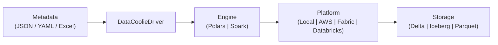

<p align="center">
  <picture>
    <source srcset="images/banners/datacoolie-banner-dark.webp" type="image/webp">
    
  </picture>
</p>

# DataCoolie — Multi-Engine, Multi-Platform Data Pipeline Framework

> Build metadata-driven pipelines with SQL and Python. Run with Polars or Spark
> across Local, AWS, Microsoft Fabric and Databricks, and distribute workloads
> across independently launched jobs.

DataCoolie keeps pipeline intent separate from execution details. Teams can
describe connections, dataflows, transforms and operational controls as
**metadata** (JSON / YAML / Excel / database / REST API), use SQL or a custom
Python function to produce a DataFrame, and execute compatible intent on the
engine and platform they need.

If you are comparing tools, start with the
[Data pipeline framework introduction](introduction/index.md) to understand
the framework boundary and its ecosystem. The [Python ETL framework decision
guide](introduction/choose-framework.md) adds workload-oriented comparison with
dataframe engines, SQL transformation tools, and workflow orchestrators.

That helps in six practical ways:

- **Metadata-driven** — connections, dataflows, transforms, schema hints,
  partitions, and load strategies stay declarative.
- **Efficient for small and medium jobs** — lighter runtimes like Polars or
  local execution can avoid cluster overhead when scale does not require
  Spark.
- **Portable** — reuse one canonical metadata model on Fabric, Databricks, or
  AWS with environment overlays and target-specific runners.
- **Consistent operations** — watermarks, logging, maintenance, and load
  behavior follow the same model across environments.
- **SQL and Python sources** — a source can combine multiple operations into
  one result DataFrame; built-in transformers then work on that current frame.
- **Independent job scale-out** — an external orchestrator can launch multiple
  Driver sessions and use stable modulo sharding for a stage.


```mermaid
flowchart LR
    A["Metadata\n(JSON / YAML / Excel)"] --> B[DataCoolieDriver]
    B --> C["Engine\n(Polars | Spark)"]
    C --> D["Platform\n(Local | AWS | Fabric | Databricks)"]
    D --> E["Storage\n(Delta | Iceberg | Parquet)"]
```

## How scale is divided

DataCoolie has three independent scaling layers:

1. An external orchestrator launches Driver sessions and assigns each one a
   `job_num` and `job_index`.
2. Each Driver schedules its assigned dataflows with its own `max_workers`,
   group and execution-order rules.
3. Polars or Spark performs the DataFrame work using the engine and host
   resources selected by the runner.

Grouped dataflows are assigned by `group_number % job_num`; ungrouped dataflows
use a stable MD5 hash of their ID modulo `job_num`. This is deterministic, not
random, and does not promise equal row counts, equal table counts or equal
runtime per job. The external orchestrator must wait for all shards before a
dependent stage starts. See [orchestration](reference/concepts/orchestration.md) for the
full contract.

## Who is DataCoolie for?

- **Data Engineers** — build and operate ETL pipelines across engines and clouds
- **Analytics Engineers** — define transforms and load strategies declaratively
- **Platform / DataOps Teams** — standardize pipeline patterns across environments
- **Data Team Leads** — reduce per-pipeline boilerplate and onboarding time

!!! tip "Start here"
    If you are new to DataCoolie and want the fastest path to a working
    pipeline, start with the [User guide](guide/getting-started/installation.md).

    If you mainly want to understand the model before touching code, read the
    [introduction](introduction/index.md) and then the technical
    [concepts](reference/concepts/architecture.md).

## Choose by goal

- **I want my first pipeline to run**
  Start with the [User guide](guide/getting-started/installation.md). For most new
  users, the best first path is Installation → Quickstart · Polars → Your first
  metadata guide.
- **I need to understand metadata and workflow design**
  Start with [Metadata guide for new users](guide/metadata/index.md),
  then read [Concepts](reference/concepts/index.md) for the deeper model.
- **I need to deploy, operate, or troubleshoot**
  Go to the [User guide](guide/index.md) for task recipes, then use
  [logging and troubleshooting](guide/operations/logging.md) for operations guidance.
- **I want to scaffold, validate, inspect, or build a project**
  Start with the [DataCoolie CLI](guide/cli/index.md), then follow the
  [project configuration and workflow](guide/cli/project.md).
- **I want to explore metadata, lineage, and run health visually**
  Open [DataCoolie Studio](studio/index.md), the local-first companion UI
  for projects, environments, metadata, assets, lineage, sources, and ETL logs.
- **I want an AI agent to build a verified DataCoolie project**
  Install the official [DataCoolie Skills](introduction/ai-skills.md),
  then watch the [multi-cloud Medallion walkthrough](examples/wwi-medallion-multicloud.md).
- **I want to extend the framework**
  Start with [Extensions](extensions/index.md) and use
  [Reference](reference/index.md) for the exact contracts and API surfaces.
- **I need the project/runtime contract**
  Read the [user guide](guide/index.md) and its
  [runtime configuration](guide/operations/runtime-configuration.md) page.

## Quick start in two scripts

Install, then run two short scripts:

1. `prepare_quickstart.py` creates a sample CSV and `metadata.json`.
2. `run_quickstart.py` loads that metadata and runs the pipeline.

```bash
pip install "datacoolie[polars]"
```

Add the optional `polars-hash` extra only when metadata uses
`transform.hash_columns`:

```bash
pip install "datacoolie[polars,polars-hash]"
```

### Part 1 — Prepare sample data and metadata

```python
# prepare_quickstart.py
import json
from pathlib import Path

root = Path("dc_quickstart")
(root / "input" / "orders").mkdir(parents=True, exist_ok=True)
(root / "output").mkdir(parents=True, exist_ok=True)

(root / "input/orders/orders.csv").write_text(
    "order_id,customer_id,amount\n1,100,19.99\n2,100,42.50\n3,101,7.25\n"
)

metadata = {
    "connections": [
        {"name": "csv_in", "connection_type": "file", "format": "csv",
         "configure": {"base_path": str(root / "input"),
                "read_options": {"header": "true", "inferSchema": "true"}}},
        {"name": "parquet_out", "connection_type": "file", "format": "parquet",
         "configure": {"base_path": str(root / "output")}},
    ],
    "dataflows": [
        {"name": "orders_csv_to_parquet", "stage": "bronze2silver",
         "processing_mode": "batch",
         "source": {"connection_name": "csv_in", "table": "orders"},
         "destination": {"connection_name": "parquet_out", "table": "orders",
                         "load_type": "full_load"},
         "transform": {}},
    ],
}
metadata_path = root / "metadata.json"
metadata_path.write_text(json.dumps(metadata, indent=2))
print(f"Created {metadata_path}")
```

```bash
python prepare_quickstart.py
```

### Part 2 — Run the pipeline

```python
# run_quickstart.py
from pathlib import Path

from datacoolie.engines.polars_engine import PolarsEngine
from datacoolie.platforms.local_platform import LocalPlatform
from datacoolie.metadata.file_provider import FileProvider
from datacoolie.orchestration.driver import DataCoolieDriver

root = Path("dc_quickstart")
metadata_path = root / "metadata.json"

platform = LocalPlatform()
engine = PolarsEngine(platform=platform)
provider = FileProvider(config_path=str(metadata_path), platform=platform)

with DataCoolieDriver(engine=engine, metadata_provider=provider) as driver:
    result = driver.run(stage="bronze2silver")
    print(f"Completed: {result.succeeded}/{result.total}")
```

```bash
python run_quickstart.py
```

The same dataflow intent can target Spark or a cloud platform. Supply the
matching runtime dependencies, runner, and environment-specific path or catalog
configuration.

## What DataCoolie gives you

| Capability | What it means for you |
| --- | --- |
| **Engine-unified** | Compatible pipeline intent runs on Polars and Spark. `BaseEngine[DF]` is the shared contract; target-specific runners select the implementation. |
| **Cloud-agnostic** | `local`, `aws`, `fabric`, and `databricks` platforms abstract file I/O and secrets while environment overlays carry target paths and catalogs. |
| **Metadata-driven** | Connections, dataflows, transforms, schema hints, partitions, and load strategies are *declarative*. Runner code still owns engine setup, imports and host-specific registration. |
| **Right-sized compute** | Small and medium jobs can stay on Polars or local execution; move to Spark when scale or platform requirements justify it. |
| **Batch-first** | `append`, `overwrite`/`full_load`, `merge_upsert`, `merge_overwrite`, and `scd2` (SCD Type 2) on supported destinations. Micro-batch and streaming are on the roadmap. |
| **Lakehouse-native** | First-class Delta Lake and Apache Iceberg through the shared `fmt=` engine API; concrete addressing and dependency support varies by engine. |
| **Extensible components** | Engines, platforms, sources, destinations, transformers, metadata providers, and secret resolvers have explicit contracts; entry-point discovery is available for declared plugin groups. |
| **Observable by default** | Structured `ExecutionLogger` (dataflow entries + job summary) and `SystemLogger` ship with the framework. |

## Where to next

<div class="grid cards" markdown>

-   :material-rocket-launch: **User guide**

    ---

    Install, run the quickstarts, and execute your first dataflow.

    [:octicons-arrow-right-24: Start here](guide/index.md)

-   :material-book-open-variant: **Reference**

    ---

    Concepts, generated contracts, environment settings, and Python API
    signatures live together in the reference.

    [:octicons-arrow-right-24: Open the reference](reference/index.md)

-   :material-code-braces: **Examples and templates**

    ---

    Small runner/project fixtures and a complete multi-cloud walkthrough.

    [:octicons-arrow-right-24: Browse examples](examples/index.md)

-   :material-puzzle-outline: **Extensions**

    ---

    Write a source, destination, transformer, engine, or secret resolver.

    [:octicons-arrow-right-24: Build a plugin](extensions/index.md)

-   :material-monitor-dashboard: **DataCoolie Studio**

    ---

    Explore metadata, lineage, assets, sources, and ETL run health in a
    local-first visual workspace.

    [:octicons-arrow-right-24: Explore Studio](studio/index.md)

-   :material-robot: **DataCoolie Skills**

    ---

    Use the official AI-assisted workflow to discover, design, build, provision,
    and release verified DataCoolie projects.

    [:octicons-arrow-right-24: Install the Skills](introduction/ai-skills.md)

</div>

## Support matrix

| Engine | Platforms | Read formats | Write formats | Load types² |
| --- | --- | --- | --- | --- |
| **Spark** | local · aws · fabric · databricks | delta, iceberg, parquet, csv, json, jsonl, avro, excel, sql, api, function | delta, iceberg, parquet, csv, json, jsonl, avro | `append`, `full_load`, `overwrite`, `merge_upsert`, `merge_overwrite`, `scd2` |
| **Polars** | local · aws · fabric · databricks | delta, iceberg, parquet, csv, json, jsonl, avro, excel, sql, api, function | delta¹, iceberg², parquet, csv, json, jsonl, avro | `append`, `full_load`, `overwrite`, `merge_upsert`, `merge_overwrite`, `scd2` |

¹ Polars writes Delta to path only — named Delta tables require Spark.
² Polars Iceberg writes use catalog-backed named-table operations; a generic path-based Iceberg write is not implemented. `merge_upsert`, `merge_overwrite`, and `scd2` require a lakehouse destination (delta or iceberg). File formats support `append`, `full_load`, and `overwrite` only. Named-table and catalog support still depends on the selected engine and optional dependencies.

See [Plugin entry points](reference/plugin-entry-points.md) for the generated
registry of every built-in plugin.

## Frequently asked questions

??? question "What is DataCoolie?"

    DataCoolie is an open-source, metadata-driven ETL framework for Python. You define pipeline intent as JSON, YAML, or Excel metadata and reuse that canonical model on Polars, Spark, Microsoft Fabric, Databricks, or AWS Glue with environment-specific overlays and runners. It handles connections, dataflows, transforms, load strategies, watermarks, and schema hints declaratively.

??? question "How is DataCoolie different from dbt, Airflow, or Prefect?"

    DataCoolie is the data pipeline execution layer, while an external scheduler owns when jobs start and how stage barriers are coordinated. Unlike a SQL-only compiler, a DataCoolie source can be SQL or Python and the resulting frame can use built-in DataFrame transforms. You can use DataCoolie inside an Airflow DAG, Prefect flow, Glue job launcher or another orchestrator. Read the [framework choice guide](introduction/choose-framework.md) for the trade-offs.

??? question "What engines and platforms does DataCoolie support?"

    DataCoolie provides a unified `BaseEngine[DF]` contract for `PolarsEngine` and `SparkEngine`. The same compatible intent can run locally or on AWS, Microsoft Fabric, and Databricks; the runner, runtime dependencies, and environment overlays supply target-specific behavior. See the [platform concept](reference/concepts/platforms.md) and the [Fabric guide](guide/platforms/fabric.md).

??? question "How does DataCoolie scale a large stage?"

    An external orchestrator can launch several Driver sessions with the same `job_num` and distinct `job_index` values. Groups use modulo assignment and ungrouped dataflows use a stable ID hash; each Driver then applies its own `max_workers` and the selected engine uses its own compute resources. DataCoolie does not promise equal-sized shards or wait for sibling jobs, so the orchestrator owns the stage barrier. See the [orchestration concept](reference/concepts/orchestration.md).

## License

[AGPL-3.0-or-later](https://github.com/datacoolie/datacoolie/blob/main/LICENSE) —
free and open source. See [Contributing](project/contributing.md) for contribution terms.

## Community

- [GitHub Issues](https://github.com/datacoolie/datacoolie/issues) — report bugs and request features
- [Contributing guide](project/contributing.md) — how to contribute code, docs, or ideas
- [Star us on GitHub](https://github.com/datacoolie/datacoolie) if DataCoolie saves you time

## Built by

DataCoolie is maintained by data engineers who got tired of rewriting the same
pipeline logic for every new cloud and engine. See the
[contributors page](https://github.com/datacoolie/datacoolie/graphs/contributors)
for everyone who has helped shape the project.
