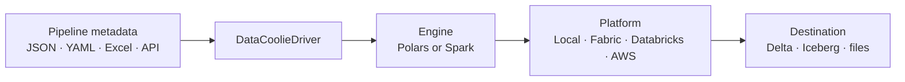

# How to choose a Python ETL framework

Choose a Python ETL framework from the work it must own: data access,
transformations, load strategies, schema evolution, watermarks, logging, and
deployment—not from a benchmark headline alone. Then choose a dataframe engine
and cloud runtime that fit the data and its downstream consumer.

DataCoolie is an open-source, metadata-driven option for defining a pipeline
once and running it with Polars or Spark across local, Microsoft Fabric,
Databricks, and AWS environments. It handles the read → transform → write →
watermark lifecycle inside each job while keeping engine and platform choices
separate from pipeline intent.

[Install DataCoolie](getting-started/installation.md){ .md-button .md-button--primary }
[Run the Polars quickstart](getting-started/quickstart-polars.md){ .md-button }

## What is a Python ETL framework?

A Python ETL framework provides reusable contracts for extracting data from
files, databases, APIs, or functions; transforming it with a dataframe engine;
and loading it into a destination. A framework should also make repeated
operational concerns—schema handling, watermarks, retries, load strategies,
logging, and maintenance—consistent across pipelines.

DataCoolie takes a metadata-driven approach. Connections, dataflows,
transformers, schema hints, partitions, and load strategies live in JSON, YAML,
Excel, a database, or a REST API. Python remains available for custom sources,
destinations, transformers, engines, and secret resolvers, but ordinary pipeline
configuration does not require a new script for every table.

## When does DataCoolie fit?

Use DataCoolie when you need one or more of these outcomes:

- Develop with **Polars locally** and run the same metadata with **Spark** when
  data or platform requirements grow.
- Move workloads between local execution, **Microsoft Fabric**, **Databricks**,
  and **AWS Glue** without embedding platform paths and secret APIs in every job.
- Standardize append, overwrite, merge/upsert, and
  [SCD Type 2](how-to/merge-and-scd2.md) loads across pipelines.
- Read from files, SQL databases, REST APIs, or Python functions and write to
  Delta Lake, Apache Iceberg, Parquet, CSV, JSON, JSONL, or Avro.
- Keep schema hints, partitions, watermarks, logging, and maintenance behavior
  visible in reviewable metadata.

DataCoolie is batch-first. If your immediate requirement is a streaming-native
runtime, use a technology built for that workload rather than treating the
current batch APIs as a substitute.

## Choose the right tool category

“ETL tool” can refer to different layers of the data stack. Start with the job
you need the tool to own:

| Need | Best-fit category | Where DataCoolie fits |
|---|---|---|
| Read, transform, load, watermark, and log one data job | ETL execution framework | This is DataCoolie's primary responsibility. |
| Schedule many tasks, manage dependencies, and retry workflows | Workflow orchestrator | Run DataCoolie inside Airflow, Prefect, or another scheduler. |
| Transform data already loaded into a warehouse with SQL models | SQL transformation tool | Use dbt for warehouse modeling; use DataCoolie for Python-native ETL before or alongside it. |
| Manipulate data on one machine | Dataframe engine | DataCoolie can execute pipeline metadata with Polars. |
| Process distributed data on a cluster | Distributed compute engine | DataCoolie can execute the same intent with Spark. |

For a deeper boundary comparison, read
[DataCoolie vs Airflow and Prefect](blog/posts/2026-05-30-datacoolie-vs-airflow-prefect.md)
and [DataCoolie vs dbt](blog/posts/2026-05-30-datacoolie-vs-dbt.md).

## How does metadata-driven ETL work?

A DataCoolie pipeline separates three decisions:

1. **Intent:** metadata describes the source, destination, transforms, load
   strategy, schema rules, and operational controls.
2. **Engine:** `PolarsEngine` or `SparkEngine` performs dataframe operations.
3. **Platform:** local, AWS, Fabric, or Databricks adapters handle environment
   concerns such as paths and secrets.

This boundary lets a team change compute or deployment environment without
rewriting the business intent. See the
[architecture guide](concepts/architecture.md) for the runtime contracts and
the [metadata model](concepts/metadata-model.md) for field-level concepts.

## Match the engine to the deployment environment

| Environment | Recommended starting point | Important exception |
|---|---|---|
| Local development and CI | Polars | Use Spark when local validation must reproduce a Spark-specific contract |
| Microsoft Fabric | Polars for small native Python jobs; Spark for distributed or advanced Delta workloads | Prefer Spark for Gold Delta tables feeding Direct Lake so V-Order can be applied deliberately |
| Databricks | Spark | Use Polars only for a measured, isolated file job that does not need Spark-native catalog behavior |
| AWS Glue or EMR Serverless | Spark | Glue Python Shell is not compatible with DataCoolie's current Python 3.11+ requirement |
| Python 3.11+ container or VM on AWS | Polars when the job fits one node | Move to Glue/EMR Spark when scale or catalog integration justifies it |

You do not need to decide permanently. Start with the
[Polars quickstart](getting-started/quickstart-polars.md), validate the metadata,
then run the [Spark quickstart](getting-started/quickstart-spark.md) to see the
same framework boundary with distributed compute. The
[Polars vs Spark decision guide](blog/posts/2026-05-26-polars-vs-spark-for-etl.md)
compares Local/CI, Fabric, Databricks, AWS Glue, EMR, and medallion-layer
trade-offs, with the local benchmark clearly separated from cloud guidance.

## What pipeline behavior is built in?

| Capability | Available behavior |
|---|---|
| Sources | Files, SQL databases, REST APIs, and Python functions |
| Engines | Polars and Spark |
| Platforms | Local, AWS, Microsoft Fabric, and Databricks |
| Lakehouse formats | Delta Lake and Apache Iceberg |
| Load strategies | Append, full load/overwrite, merge upsert, merge overwrite, and SCD2 |
| Operations | Watermarks, structured logging, schema hints, partitioning, optimize, and vacuum |
| Extensions | Plugin registries for sources, destinations, transformers, engines, platforms, metadata providers, and secret resolvers |

Review the complete, versioned details in the
[metadata reference](reference/metadata-schema.md) and generated
[plugin entry-point reference](reference/plugin-entry-points.md).

## Start a Python ETL pipeline

1. [Install the Polars runtime](getting-started/installation.md) for the smallest
   first setup.
2. [Run the quickstart](getting-started/quickstart-polars.md) to create a working
   CSV-to-output pipeline.
3. [Use your own data](getting-started/use-your-own-data.md) by replacing the
   example paths and table definitions while keeping the runner pattern.

When you are ready to deploy, continue with the platform-specific guides for
[Microsoft Fabric](how-to/deploy-to-fabric.md),
[Databricks](how-to/deploy-to-databricks.md), or
[AWS Glue](how-to/deploy-to-aws-glue.md).
