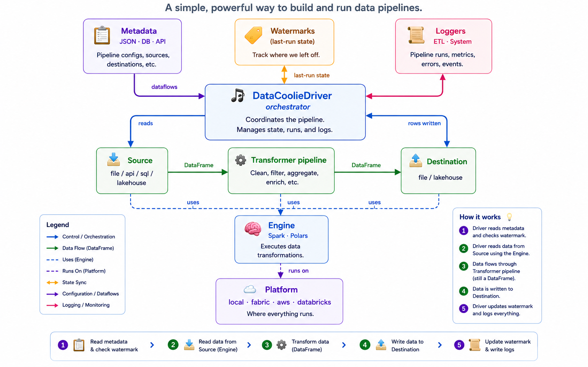
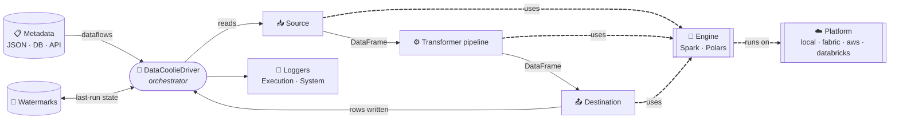
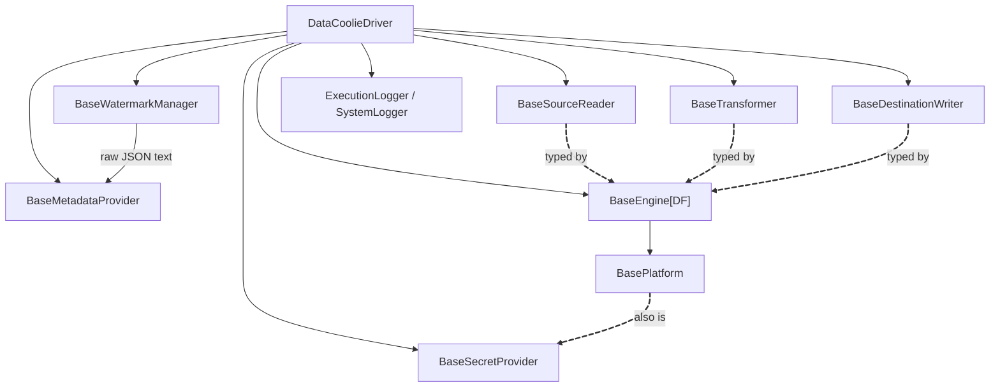
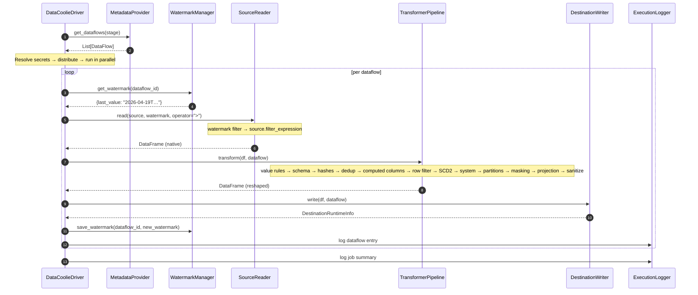

# Architecture

**TL;DR** Think of DataCoolie as a **conductor** (the `DataCoolieDriver`) and an
**orchestra of swappable musicians** (plugins). The conductor reads sheet music
(metadata), tells each musician when to play, and writes the recording
(watermarks + logs). Each extension targets an abstract base class. Built-ins
are registered lazily by the runtime bootstrap when a factory or registry is
first requested, while installed extensions are discovered through Python
**entry points**.

<div class="dc-video-embed">
  <iframe
    src="https://www.youtube-nocookie.com/embed/x_z8J92NM4w"
    title="DataCoolie Architecture Explained: Metadata-Driven ETL Framework"
    loading="lazy"
    allow="accelerometer; autoplay; clipboard-write; encrypted-media; gyroscope; picture-in-picture; web-share"
    referrerpolicy="strict-origin-when-cross-origin"
    allowfullscreen>
  </iframe>
</div>

[Watch the architecture overview on YouTube](https://www.youtube.com/watch?v=x_z8J92NM4w)

## The mental model



*DataCoolie separates pipeline intent, execution, state, and observability into
explicit boundaries. The Mermaid diagram below provides the same model in a
text-friendly form.*



- **Solid arrows** = data flow.
- **Dashed arrows** = "uses / delegates to".
- The **engine** is the only box that knows what a DataFrame *is*; the
  **platform** is the only box that knows what a *filesystem* is.

## The eight roles

| # | Role | Base class | What it decides | Example plugins |
|---|------|------------|-----------------|-----------------|
| 1 | **Metadata provider** | `BaseMetadataProvider` | *Where do dataflow definitions live?* | `file`, `database`, `api` |
| 2 | **Watermark manager** | `BaseWatermarkManager` | *How do we remember where we left off?* | `WatermarkManager` (wraps any metadata provider) |
| 3 | **Engine** | `BaseEngine[DF]` | *What computes the DataFrame?* | `spark`, `polars` |
| 4 | **Platform** | `BasePlatform` | *Where do files, tables, and secrets live?* | `local`, `fabric`, `aws`, `databricks` |
| 5 | **Source reader** | `BaseSourceReader` | *How do we load this format into a DataFrame?* | `delta`, `iceberg`, `csv`, `sql`, `api`, … |
| 6 | **Transformer** | `BaseTransformer` | *How do we shape the DataFrame before writing?* | `column_value_transformer`, `schema_converter`, `deduplicator`, `column_projector`, … |
| 7 | **Destination writer** | `BaseDestinationWriter` | *How do we persist the DataFrame?* | `delta`, `iceberg`, `parquet`, … |
| 8 | **Secret provider** | `BaseSecretProvider` | *Where do connection secrets come from?* | platform-native providers via `local`, `fabric`, `aws`, `databricks` |

Secret resolvers (`BaseSecretResolver`) are companion syntax adapters around
that provider layer, not a ninth execution role. See [Secrets](secrets.md) and
[ADR-0002](../../project/decisions/0002-secret-provider-resolver-split.md).

## Who depends on whom

At the extension boundary, third-party plugins depend on *abstract bases only*
and do not import sibling implementations. Built-in driver wiring may infer
concrete components when callers leave them unset, including `FileProvider`,
`WatermarkManager`, and engine/source/destination backend adapters. That
convenience belongs below the plugin boundary.



Key invariants:

- **Driver ↔ extension contracts** — third-party wiring uses the base classes;
  built-in defaults may select concrete providers and adapters as described
  above.
- **Engine owns platform control-plane access** — `engine.platform.list_files(...)`
  is the framework path for metadata, log, watermark, and other control-plane
  filesystem operations. Business-data reads and writes use native engine
  connectors/adapters; platform credentials and paths do not replace them.
- **Secret provider is abstract too** — `DataCoolieDriver` accepts an explicit
  `secret_provider`; otherwise it falls back to `engine.platform` because
  `BasePlatform` subclasses `BaseSecretProvider`.
- **Sources, transformers, destinations are generic over the engine DataFrame
  type**, which lets a type checker catch mismatches in correctly typed plugin
  and application code.
- **Watermark manager wraps the metadata provider** — provider returns raw JSON
  text, manager parses `Dict[str, Any]`. See
  [ADR-0004](../../project/decisions/0004-raw-json-watermark-contract.md).

## Runtime flow (one dataflow)



Inside the driver, three helpers split the work:

- **`JobDistributor`** — given `(job_num, job_index)`, keeps only the slice of
  dataflows this worker owns. Lets you shard a run across N pods.
- **`ParallelExecutor`** — runs the selected slice through one coordinator pool. `max_workers`
  is the global dataflow concurrency cap for that invocation; grouped scheduling does not create
  nested pools. See [Orchestration](orchestration.md).
- **`RetryHandler`** — wraps each dataflow with configurable retries/backoff.

## Why `BaseEngine[DF]` is generic

`BaseEngine` is parameterised by `DF`, the *native* DataFrame type:

| Engine | `DF` binds to | Why it matters |
|---|---|---|
| `SparkEngine` | `pyspark.sql.DataFrame` | `mypy --strict` sees Spark-only methods (`.withColumn`, …) |
| `PolarsEngine` | `polars.LazyFrame` | `mypy --strict` sees Polars-only methods (`.with_columns`, …) |

Sources, destinations, and transformers carry the same `DF` parameter. This
improves static checking for plugin implementations; the non-generic driver
still relies on registry wiring and runtime contracts, so it is not a universal
compile-time guarantee for arbitrary dynamically loaded combinations.

The `fmt=` parameter on engine methods (`read_table(fmt="delta")`,
`merge_to_table(..., fmt="iceberg")`, `table_exists_by_name(*, fmt="delta")`)
unifies Delta Lake and Apache Iceberg at the engine level. See
[Engines](engines.md) and [ADR-0001](../../project/decisions/0001-engine-fmt-parameter.md).

## Plugin boundary: how swap-ability actually works

The runtime exposes six plugin registries — engine, platform, source,
destination, transformer, and resolver — through the lazy package surface in
[`datacoolie/__init__.py`](https://github.com/datacoolie/datacoolie/blob/main/src/datacoolie/__init__.py).
The registries are constructed and built-ins are registered lazily by
`_bootstrap` when a factory or registry is first requested:

```python
engine_registry:      PluginRegistry[BaseEngine]      = PluginRegistry("datacoolie.engines", BaseEngine)
platform_registry:    PluginRegistry[BasePlatform]    = PluginRegistry("datacoolie.platforms", BasePlatform)
source_registry:      PluginRegistry[BaseSourceReader]      = PluginRegistry("datacoolie.sources", BaseSourceReader)
destination_registry: PluginRegistry[BaseDestinationWriter] = PluginRegistry("datacoolie.destinations", BaseDestinationWriter)
transformer_registry: PluginRegistry[BaseTransformer] = PluginRegistry("datacoolie.transformers", BaseTransformer)
resolver_registry:    PluginRegistry[BaseSecretResolver]    = PluginRegistry("datacoolie.resolvers", BaseSecretResolver)
```

Secret providers are typically supplied by platforms, so there is no separate
provider registry. Metadata providers and watermark managers are constructor-
injected rather than registry types. Resolver plugins handle prefixed
`secrets_ref` sources; the provider role is satisfied by the active platform
unless you inject a different `BaseSecretProvider` into the driver.

`PluginRegistry` also performs lazy entry-point discovery: the first
`.get(...)`, `.list_plugins()`, or `.is_available(...)` call scans the matching
installed entry-point group (`datacoolie.engines`, …). A third-party package
can ship a plugin by declaring:

```toml
[project.entry-points."datacoolie.engines"]
duckdb = "my_pkg.duckdb_engine:DuckDbEngine"
```

…with no import of `datacoolie` at install time. See
[Plugin entry points](../plugin-entry-points.md) for the full
generated table.

## Driver execution modes

The driver supports three execution modes through separate entry points:

| Method | Purpose | Watermark behaviour |
|--------|---------|---------------------|
| `run()` / `run_dataflow()` | Normal incremental ETL | Reads `>` last saved, saves new max after write |
| `run_replay(dataflows, replay)` | Bounded historical re-processing in chunks | Operator `>=` (inclusive); saves per-chunk only when `save_watermark=True` |
| `run_maintenance(connection)` | `OPTIMIZE` / `VACUUM` for lakehouse tables | N/A — no data movement |

Normal ETL loaded from metadata uses `JobDistributor` for active/stage
selection and job sharding, then `ParallelExecutor` and `RetryHandler` for
execution. `run_replay` uses a flat `ParallelExecutor` over the dataflows it is
given and does not apply sharding itself; callers should pass the result of
`load_dataflows(...)` when they need selection and sharding. Maintenance loaded
from metadata is deduplicated and distributed, while an explicitly supplied
`dataflows` list is deduplicated but not re-sharded. Replay adds sequential
chunk iteration *within* each dataflow.

See [Orchestration](orchestration.md) for details on each mode.
