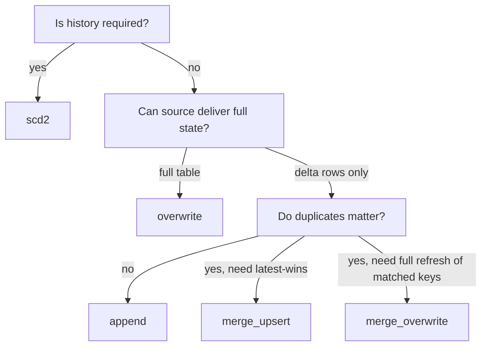

# Load strategies

**TL;DR** `destination.load_type` accepts six values representing five
underlying strategies: `append`, `overwrite` (aka `full_load`), `merge_upsert`,
`merge_overwrite`, and `scd2`. Each maps onto a specific `BaseEngine` method.

## Strategy matrix

| `load_type` | Engine method | Touches existing rows? | Keys required | Typical use |
|---|---|---|---|---|
| `append` | `write_to_*(mode="append")` | no | — | Event streams, fact tables where duplicates are acceptable. |
| `overwrite` / `full_load` | `write_to_*(mode="overwrite")` | replaces everything | — | Daily snapshot dims, aggregates. |
| `merge_upsert` | `merge_to_*` | updates matched, inserts unmatched | `merge_keys` | Incremental CDC-style loads. |
| `merge_overwrite` | `engine.merge_overwrite` (key-based) or `engine.replace_window` (bounded) | key-based overwrite, or bounded window replacement | `merge_keys` for key-based mode; none when a valid replacement window is present | "Rolling overwrite" when source always holds full current-state for a window. |
| `scd2` | `scd2_*` | closes out matched, inserts new version | `merge_keys` | Slowly-changing dimensions with history. |

!!! info "`full_load` vs `overwrite`"
    Same semantics. `full_load` is kept for metadata authored before the enum
    was consolidated.

Operation options are separated at the destination boundary. Append and
overwrite use `write_options`. `merge_upsert` uses `merge_options`. Key-based
`merge_overwrite` and `scd2` use `merge_options` for the merge/build operation
and pass `write_options` to the final writer when the engine supports that
split. A bounded `replace_by_watermark` operation calls
`engine.replace_window` with `write_options` only; it does not consume merge
predicates or aliases and does not require `merge_keys` when the window is
valid. Existing omitted-option defaults remain unchanged.

For flat-file destinations that use `connection.configure.date_folder_partitions`,
`overwrite` and `full_load` replace only the resolved current UTC folder. Older
date folders remain as snapshots.

## `merge_upsert` (SCD1 / CDC)

Standard upsert: rows with matching `merge_keys` are **updated**, rows without
a match are **inserted**. Nothing is deleted.

```json
"destination": {
  "load_type": "merge_upsert",
  "merge_keys": ["customer_id"]
}
```

## `merge_overwrite` (rolling overwrite)

Used when the source always holds the *current state* for a set of keys or a
watermark window. Without a usable window, existing rows matching `merge_keys`
are deleted and re-inserted from the source. With
`destination.configure.replace_by_watermark=true`, the execution pipeline
passes an attempt-local window to the engine's `replace_window` operation and
uses `destination.write_options` only; merge keys are not required for that
bounded mode. Without a usable window, the strategy calls
`engine.merge_overwrite` with `destination.merge_options` and the optional
`destination.write_options` path for the key-based operation.

The engine owns the native predicate and replacement ordering. The default
portable implementation is delete then append (not atomic). A confirmed empty
replay removes the existing scope without creating an absent target; an
ordinary empty incremental read is skipped.

Example: nightly snapshot of "last 7 days" — everything older is already final;
everything inside the window is delivered fresh.

## `scd2` (Type 2 with history)

`SCD2ColumnAdder` (order 60) reads the metadata-declared
`destination.configure.scd2_effective_column` (a source business-time column) and adds
three framework columns before write:

- `__valid_from` — copied from the effective column
- `__valid_to` — initially NULL
- `__is_current` — initially `true`

The engine's `scd2_to_path` / `scd2_to_table` then runs a two-step MERGE:

1. **Close step** — for every source row whose `merge_keys` match a target row
   where `__is_current = true` *and* the source `__valid_from` is later than
   the target `__valid_from` (late-arrival guard), set
   `__valid_to = source.__valid_from` and `__is_current = false`.
2. **Append step** — insert all source rows as new versions.

Because the late-arrival guard applies only to the close step, equal or older
effective timestamps are still appended. Filter/deduplicate upstream so each
key advances strictly beyond its current `__valid_from`.

SCD2 is implemented by the built-in Delta and Iceberg engine operations. The
generic `BaseEngine` contract exposes SCD2 methods, but its default
implementations do not provide a fallback, and flat-file destinations do not
support SCD2. Addressing still follows the selected engine: for example,
Polars uses a Delta path or a catalog-backed Iceberg table.

No hash column is stored; versioning is driven entirely by the effective-date
column you nominate. See [Destination and load patterns](../../guide/metadata/destination-and-load-patterns.md)
for a worked example.

## Choosing a strategy



## Related

- [ADR-0001 · Engine `fmt=` parameter](../../project/decisions/0001-engine-fmt-parameter.md)
- [`reference/api/destinations`](../api/destinations.md)
- See [Destination and load patterns](../../guide/metadata/destination-and-load-patterns.md) for the authored configuration and [Incremental SCD2](../../guide/metadata/merge-and-scd2.md) for a combined case.
- Blog: [Polars vs Spark for ETL](../../blog/posts/2026-05-26-polars-vs-spark-for-etl.md)
