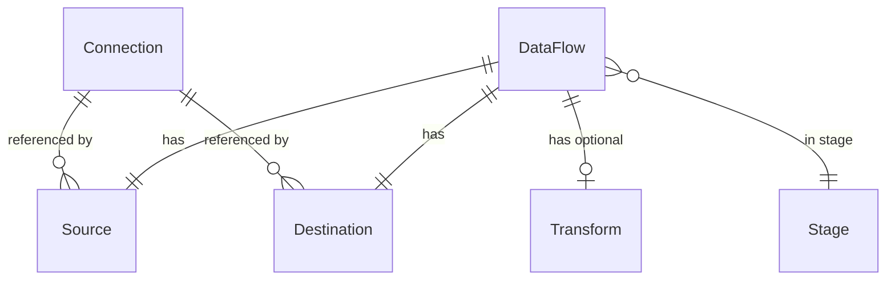

# Metadata model

**TL;DR** DataCoolie metadata is driven by `Connection`, `DataFlow` (with
nested `Source`, `Destination`, and `Transform`), and `SchemaHint`. These are
`CompatModel`-backed dataclasses from
`datacoolie.core.models.connection`, `datacoolie.core.models.dataflow`, and
the other focused modules under `datacoolie.core.models`.

## Mental model

Connections are **shared** (used by many dataflows); sources, destinations, and
transforms are **dataflow-scoped**.

## Top level

### `Connection`

An *endpoint*: file root, lakehouse path, RDBMS, or REST API.

- `name` (required, used as the `connection_id` via `name_to_uuid`)
- `connection_type` (`file`, `lakehouse`, `database`, `api`, `function`, `streaming`)
- `format` (`parquet`, `delta`, `iceberg`, `csv`, `json`, `jsonl`, `avro`, `excel`, `sql`, `api`, `function`)
- `configure` — **a JSON object** of type-specific settings (`base_path`, `host`, `port`, `read_options`, `write_options`, `merge_options`, `url`, `driver`, …)
- `secrets_ref` — `{vault_source: [field, …]}` map (see [Secrets](secrets.md))
- `is_active` — defaults to `true`; `false` retains the endpoint in metadata
  and skips selected dataflows using it as source or destination

Model validation **cross-checks** `format` against `connection_type` using
`CONNECTION_TYPE_FORMATS`. If you omit `connection_type`, the model derives it
only when `format` matches one of those known mappings. An unknown or custom
format does not provide an inferred connection type, and registering a runtime
reader or writer does not expand the project-owned JSON Schema or make omission
of `connection_type` a `dc validate` workaround.

The project-owned, versioned JSON Schema is the authored structural contract and
rejects unknown authored fields outside documented extension/configure maps.
`dc validate` runs that check before model and cross-entity validation; model
construction alone is not an unknown-field check.

### `DataFlow`

One logical ETL unit. Fields:

- `name`, `stage` (free-form string; filters passed to `driver.run(stage=…)`
  match stage values)
- `source`, `destination`, `transform` (nested models)
- `is_active`, `processing_mode`, `group_number`, and `execution_order`

`DataFlow.is_active: false` excludes normal selection and prevents execution
when a caller supplies the dataflow directly. The source and destination
connections must also be active. See the [metadata guide](../../guide/metadata/dataflows.md#activation-and-selection).

Computed properties: `deduplicate_columns` (from `transform.deduplicate_column_names(merge_keys)`), `order_columns` (from `transform.latest_data_columns` or `source.watermark_columns`).

### `Source`, `Destination`

Reference a connection by name plus:

- `schema_name`, `table` — used to build the path (`{base_path}/{schema_name}/{table}`) or the qualified name (`` `catalog`.`database`.`schema`.`table` ``)
- source-only: `query` — inline SQL, or a relative `.sql` file reference when
  the provider or Driver is given `sql_base_path`/`artifact_base_path`. Explicit SQL roots
  use their configured folder-leaf prefixes; without them the complete path
  is joined below `artifact_base_path` (there is no fixed `sql/` folder). Use
  `artifact:/<relative>` for an explicit artifact-root reference
- source-only: `watermark_columns` — list of column names used for incremental reads
- source-only: `filter_expression` — SQL predicate combined with or applied after the watermark condition, against reader output columns (including aliases returned by `source.query`)
- source-only: `python_function` — dotted module/function path used by a
  `function` source; the function receives the `Source` model and the active
  read bounds (see [Sources & destinations](sources-and-destinations.md))
- destination-only: `load_type` (`append` / `overwrite` / `full_load` / `merge_upsert` / `merge_overwrite` / `scd2`), `merge_keys`, `partition_columns`, and operation-specific `configure.merge_options`

Two destination settings are effective properties backed by `destination.configure`,
not top-level authored fields: `replace_by_watermark` enables bounded replacement
for `merge_overwrite` when a usable source window exists, and
`scd2_effective_column` names the source business-time column used to create the
SCD2 validity columns. Source `read_options` is likewise read from the source
configuration and merged with the referenced connection's defaults; the
format-specific routing is described in [Sources & destinations](sources-and-destinations.md).

### `Transform`

- `deduplicate_columns` — list of key column names for deduplication (maps to `Deduplicator`)
- `latest_data_columns` — columns used to pick the latest row when deduplicating
- `additional_columns` — list of `{column, expression}` for computed columns
- `filter_expression` — SQL predicate applied at transformer order 35 (after `ColumnAdder` creates computed columns)
- `schema_hints` — list of `SchemaHint` rows applied by the `SchemaConverter`
- `configure` — arbitrary JSON options passed through to transformers

See [Transformers & pipeline](transformers-and-pipeline.md) for how these map
onto transformer instances.

## Why `configure` (JSON blob) instead of a flat schema?

Each connection type has a different set of options — `read_options` on a file,
`url` and `driver` on a database, `endpoint` and `pagination` on an API. A flat
column per option would balloon the schema and break every time a new option is
added.

Instead, **`configure` is a typed JSON object** stored as text in the DB
provider, a raw dict in the file provider, and serialised by the API provider.
Properties surface the most-used values
(`base_path`, `host`, `port`, `url`, `driver`, `read_options`, `write_options`)
as first-class attributes so callers don’t need to dig into the dict.

!!! info "Naming: `configure`, not `config`"
    The persistent column and field are named `configure`, not `config`.
    The verb form avoids conflicts with framework internals.

## Backward-compat lifts

When `configure` contains `catalog` or `database`, model initialization lifts
them to first-class `Connection.catalog` / `Connection.database` attributes so
old metadata keeps working. Call `connection.refresh_from_configure()` after
secret resolution to pick up resolved values.

## Reference

- Fully field-by-field authored contract: [Metadata reference](../metadata-schema.md#metadata-document).
  The reference is generated from the selected bundled schema. The canonical JSON resources are published under
  [`/schema/index.json`](../../schema/index.json); use the stable
  [`latest` alias](../../schema/latest/metadata.schema.json) for current
  authoring, while versioned URLs remain the reproducible contract. The
  generated page documents authored paths, schema conditions and reviewed
  runtime semantics.
- Python model signatures and hydrated/runtime-only properties: [Core API](../api/core.md).
- Driver/session controls are intentionally separate: see [Run configuration](../runtime-configuration.md#run-configuration)
  for `DataCoolieRunConfig`, [Replay configuration](../runtime-configuration.md#replay-configuration)
  for `ReplayConfig`, and [Logging configuration](../runtime-configuration.md#logging-configuration)
  for `LogConfig` and caller `run_attributes`.
- How to author metadata in each backend:
  [file](../../guide/providers/file.md) · [database](../../guide/providers/database.md) · [API](../../guide/providers/api.md).
