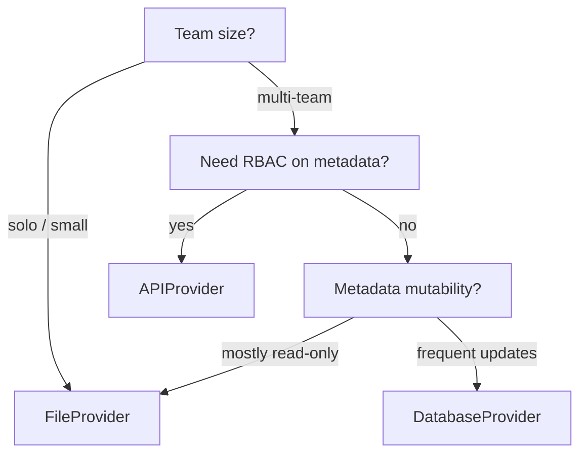

# Metadata providers

**TL;DR** Pick `FileProvider` for small fixed projects, `DatabaseProvider` for
shared team metadata, `APIProvider` when you already run a metadata
service. All three implement the same `BaseMetadataProvider` contract, so you
can swap them without changing pipeline code.

## The contract

`BaseMetadataProvider` exposes:

- `configure_context(context)` then `initialize()` / `is_initialized` — the
  typed `MetadataProviderStartupContext` startup boundary and explicit provider
  readiness. The base hook accepts irrelevant common defaults, but rejects an
  explicit `metadata_base_path` because that path is a FileProvider concern;
  providers with different path semantics must override the hook and validate
  their own inputs. Watermark managers have their own backend configuration
  contract.
- `get_connections()` / `get_connection_by_name(name)`
- `get_dataflows(stage=..., active_only=True, attach_schema_hints=True)`
- `get_watermark(dataflow_id: str) -> Optional[str]` — raw JSON, not parsed
- `update_watermark(dataflow_id, watermark_value, *, job_id, dataflow_run_id)`
- `sql_base_path` — one SQL root or an ordered sequence of roots associated
  with metadata query references. The provider stores this configuration;
  Driver preparation reads the selected file through its execution platform.

The raw-JSON return of `get_watermark` is intentional — `WatermarkManager` does
the deserialisation so providers don't need to depend on datetime handling.
See [Watermarks](watermarks.md) and [ADR-0004](../../project/decisions/0004-raw-json-watermark-contract.md).

`get_connections(active_only=True)` filters on connection activity;
`get_dataflows(active_only=True)` filters on dataflow activity. Pass
`active_only=False` to inspect inactive records. Individual connection lookup
and dataflow hydration can still resolve inactive connections. The Driver
checks both endpoint flags before execution; provider visibility does not
grant permission to run an inactive dataflow.

### Startup, cache, and ownership

Constructors record provider configuration. `initialize()` validates the
complete configured scope, including inactive records, and publishes a
validated snapshot when caching is enabled. It is idempotent. A Driver calls
this boundary during startup; standalone callers can call it after binding any
required platform.

`clear_cache()` resets initialization for cache-enabled database/API providers,
so the next metadata read reloads the snapshot. For `FileProvider`, the parsed
source data remains retained; clearing its cache rebuilds models from that
retained data. With `enable_cache=False`, reads still validate the complete
scope but do not publish a reusable snapshot. Recreate a `FileProvider` when an
edited file must be read in a later session.

The Driver closes only a provider that it created. A provider passed through
`metadata_provider=` remains caller-owned and must be closed by that caller
after the Driver has finished. Closing a provider does not close a platform
passed to it. `DatabaseProvider` disposes only an engine it created, while
`APIProvider` closes the HTTP client it created.

## Built-ins

| Provider | Backend | Install | Good for |
|---|---|---|---|
| `FileProvider` | JSON · YAML · Excel | core + `[metadata-yaml]` / `[metadata-excel]` | Small projects, SCM-versioned metadata, demos |
| `DatabaseProvider` | Any SQLAlchemy dialect | `[metadata-db]` | Multi-team, mutable metadata, centralised governance |
| `APIProvider` | REST | `[source-api]` | Existing metadata service, RBAC on metadata |

## File provider

- Canonical source is **JSON**; YAML and Excel are generated equivalents.
- A provider may read one exact file (or an ordered list), or discover a
  deployed metadata directory recursively. Directory mode is deterministic:
  supported files are sorted by path and each file must use section wrappers
  such as `{"connections": [...]}` or `{"dataflows": [...]}`. Filenames do
  not imply a stage, so `source2bronze.json` is just a shard name.
- `metadata_base_path` is the explicit directory input. The Driver/factory
  convention is `<artifact_base_path>/metadata`; an explicit metadata path
  wins over that default. The discovery boundary never scans artifact
  siblings such as `sql/` or `functions/`.
- If no provider is injected, either `metadata_base_path` or
  `artifact_base_path` makes the Driver create a `FileProvider`. If a provider
  is injected, the same path is passed through `configure_context`; equal
  normalized FileProvider roots are idempotent, while conflicting roots and
  `config_path` plus a metadata root fail before metadata I/O.
- `FileProvider` construction is configuration-only. `platform` is optional
  at construction and is bound by `DataCoolieDriver` when omitted, or by
  `bind_platform(platform)` for standalone use. The first metadata read (or an
  explicit `initialize()`) validates the platform and loads the complete
  configured scope.
- Blank `is_active` in Excel means **unset** (not `False`). Generators preserve this nuance.
- Constructors only configure providers. `initialize()` (called by Driver
  startup or automatically by the first public metadata read) loads and
  validates the complete configured scope, including inactive rows, before a
  snapshot is published to the cache. Malformed references, duplicate
  identities, and invalid shard records fail startup; there are no legacy
  eager-prefetch constructor flags. Use `initialize()` when an application
  wants an explicit startup boundary before the first metadata read.
- `FileProvider` owns file watermark paths, but does not infer one from the
  metadata config directory. Pass `watermark_base_path` explicitly for
  standalone use, or let `DataCoolieDriver` bind it from
  `state_base_path/watermarks` (preferred) or the parent of `log_base_path`.
  If no root is bound, metadata reads still work and watermark operations
  raise a clear configuration error.
- `FileProvider` may also receive `sql_base_path`; it is independent of the
  metadata directory. The Driver-level value is a session fallback when the
  provider omits it, and conflicting explicit SQL roots fail before startup.

## Database provider

- SQLAlchemy tables: `dc_framework_connections`, `dc_framework_dataflows`,
  `dc_framework_watermarks`, `dc_framework_schema_hints`.
- Connections and dataflows carry `workspace_id` and `deleted_at`; provider
  reads apply both workspace and soft-delete filters to those records.
- Schema hints carry `connection_id`, optional `dataflow_id`, and `deleted_at`.
  The provider verifies that their owning connection and optional dataflow are
  visible in the configured workspace before returning them.
- Watermarks are keyed by unique `dataflow_id` and do not carry workspace or
  soft-delete columns. Reads and writes first verify the owning dataflow, so
  foreign or deleted owners are never exposed or mutated.
- Concurrency-safe writes: `DatabaseProvider` opens one short-lived connection
  per operation and does not hold a session across `run()` boundaries.
- `sql_base_path` is retained as provider configuration; SQL file reads remain
  in Driver preparation and use the Driver execution platform.

## API provider

- Client calls a REST service whose expected contract is exercised by
  `usecase-sim/docker/pg_api_metadata_server.py` as a reference implementation.
- All endpoints are scoped under `/workspaces/{workspace_id}/`.
- A valid response with `current_value: null` or a resource 404 means that a
  watermark has not been created. Authentication, transport, server and
  malformed-response failures raise `WatermarkError`; they are not treated as
  an empty watermark.
- Read-through cache can be enabled via `enable_cache=True` (the default) to avoid
  hammering the service during parallel execution.
- The API provider owns the HTTP client it creates; call `close()` after an
  injected provider is no longer used.
- `sql_base_path` is retained as provider configuration; the API provider does
  not need a platform or local file access to store it.

## Picking a provider

## Related

- [User guide · Configure file metadata](../../guide/providers/file.md)
- [User guide · Configure database metadata](../../guide/providers/database.md)
- [User guide · Configure API metadata](../../guide/providers/api.md)
- [`reference/api/metadata`](../api/metadata.md)
