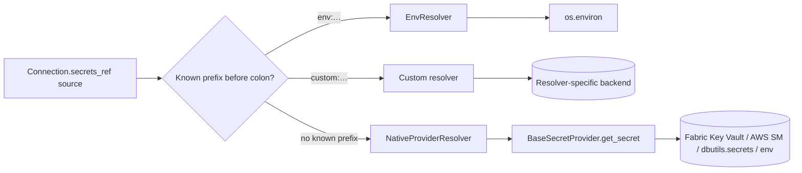

# Secrets

**TL;DR** DataCoolie has **two** secret interfaces: `BaseSecretProvider`
(the active platform's native backend) and `BaseSecretResolver` (selected by a
prefix on a `secrets_ref` source key). Values in `Connection.configure` name
the secret keys to fetch.

## Provider vs resolver



- **Provider** (`BaseSecretProvider`) = **where** secrets live.
  Each platform is a native provider by subclassing `BasePlatform`, so every
  platform brings its own secret backend:
  Local uses `os.environ`, Fabric uses Azure Key Vault through
  `notebookutils.credentials`, Databricks uses native or SDK-backed
  `dbutils.secrets`, and AWS uses AWS Secrets Manager.
- **Resolver** (`BaseSecretResolver`) = **how** to resolve a key when the
  `secrets_ref` source begins with a registered prefix. Built-in `EnvResolver`
  handles sources such as `env:APP_`; you can add more.

The resolver parser splits a source at its first colon. A registered prefix
routes the suffix to that resolver; an unrecognised or unprefixed source falls
back to `NativeProviderResolver`, which calls the active native provider with
the full source string. A custom resolver owns its own backend access because
the resolver contract is only `resolve(key, source)`. See
[ADR-0002](../../project/decisions/0002-secret-provider-resolver-split.md).

## `secrets_ref` schema

`Connection.secrets_ref` maps each secret source to the `configure` fields that
should be resolved from that source. Each listed field must already exist in
`configure`, and its current value must be the vault key or secret name to look
up:

```json
{
  "configure": {
    "host": "db.internal",
    "port": 5432,
    "username": "db-user-secret",
    "password": "db-password-secret"
  },
  "secrets_ref": {
    "https://myvault.vault.azure.net/": ["password"],
    "env:": ["username"]
  }
}
```

At resolve time DataCoolie:

1. For each `source`, for each `field`: fetch the secret value from the
  provider and **replace** `configure[field]` with the resolved value.
2. Calls `connection.refresh_from_configure()` so first-class attributes
   (`database`, `catalog`) pick up resolved values.

Resolution is idempotent on a runtime connection. If a field already contains
`SecretStr`, repeated calls leave it unchanged instead of treating the masked
`"***"` representation as another secret key. Preparation first deep-copies
the declarative dataflow and hydrates each execution connection once. Normal
and maintenance retries receive a fresh deep copy of that prepared execution
baseline; they do not rehydrate secrets and never reuse a mutated attempt copy.
Replay also prepares once, then deep-copies that prepared baseline for each
chunk; retries within a chunk receive their own fresh attempt copy. The
original metadata retains its secret references. Separate runs prepare their
own execution copies, while native providers can serve matching `(source,
key)` lookups from their TTL cache. Maintenance resolves only the destination
connection because it does not create or use a source reader.

Native provider caching defaults to a 300-second TTL and is keyed by
`(source, key)`. Set the provider's `cache_ttl` to `0` to disable caching;
positive values select a different TTL.

If a field is listed in `secrets_ref` but missing from `configure`, DataCoolie
raises an error instead of guessing where the secret should be written.

Constraint: **a `field` must appear under exactly one `source`**. Listing the
same field under two sources is ambiguous and raises `ConfigurationError`.

## Built-in resolvers

Only one: `EnvResolver` for `env:*` lookups. Register more via the
`datacoolie.resolvers` entry-point group.

## `SecretStr` — Opaque secret wrapper

Resolved secret values are wrapped in `SecretStr`, an opaque object that
**prevents accidental exposure** through `str()`, `repr()`, `print()`,
f-strings, and tracebacks.  All public representations render `***`.

There is no extraction method on `SecretStr`. Framework code and extension
authors use two module helpers at I/O boundaries:

| Helper | Purpose |
|--------|---------|
| `unwrap_secret(value)` | Extract the raw `str` from a `SecretStr` (identity for plain strings) |
| `unwrap_configure(configure)` | Shallow-copy a configure dict, unwrapping top-level `SecretStr` values |

This replaces the earlier `SensitiveValueFilter` log filter approach.  Instead
of scrubbing framework-owned values from log messages after the fact, the
framework keeps resolved credentials wrapped at its normal logging boundaries.
An application or plugin that deliberately unwraps and logs a raw credential is
outside that protection and must redact it at its own boundary.

!!! warning "Extension authors"
    If your plugin receives a `Connection.configure` dict, call
    `unwrap_configure(configure)` before passing values to external clients
    (HTTP auth, JDBC connection strings, etc.).  The wrapped values will not
    work as raw strings.

## Built-in providers

All four platforms. `AWSPlatform._fetch_secret` goes to AWS Secrets Manager;
`FabricPlatform` uses `notebookutils.credentials` in Fabric and
`azure-keyvault-secrets` with an injected credential or
`DefaultAzureCredential` outside Fabric; `DatabricksPlatform` uses native
`dbutils.secrets` in Databricks and `WorkspaceClient.dbutils.secrets` outside
Databricks; `LocalPlatform` reads `os.environ`.

## Related

- [ADR-0002 · Secret provider / resolver split](../../project/decisions/0002-secret-provider-resolver-split.md)
- [Writing a secret resolver](../../extensions/writing-a-secret-resolver.md)
