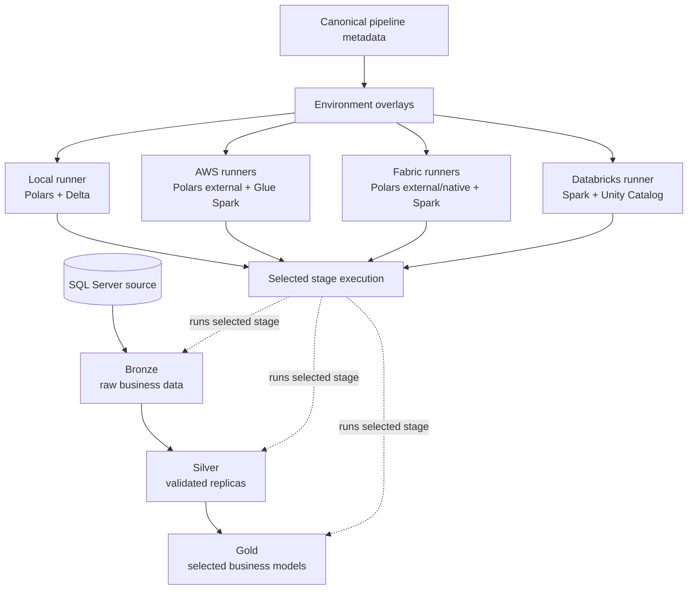

# Build a Multi-Cloud Medallion Pipeline with DataCoolie Skills

This 35-minute case study follows a Wide World Importers pipeline from source
discovery to local execution and three cloud targets. It demonstrates the
official [DataCoolie Skills workflow](../getting-started/ai-assisted-workflow.md)
with the package and Skills available when the recording was made.

The recorded project workspace is private and is not required for this
tutorial. Resource names and credentials are intentionally omitted; use your
own accounts, identities, and environment-specific configuration.

  <iframe
    src="https://www.youtube-nocookie.com/embed/L9ejQf9tYAE"
    title="Build a Medallion Data Pipeline with DataCoolie and AI"
    loading="lazy"
    allow="accelerometer; autoplay; clipboard-write; encrypted-media; gyroscope; picture-in-picture; web-share"
    referrerpolicy="strict-origin-when-cross-origin"
    allowfullscreen>
  </iframe>

**Choose a language:**
[English video](https://youtu.be/L9ejQf9tYAE) ·
[Video tiếng Việt](https://youtu.be/0lnxfS6WYew)

## What the demo proves

- Discover inspects the declared SQL Server source before architecture and
  metadata are finalized.
- Design records watermark, load, model, runtime, and recovery decisions and
  pauses for approval when the material architecture changes.
- Build produces canonical metadata, environment overlays, target-specific
  runners, immutable artifacts, and verification evidence.
- Provision and Release remain separate, explicitly authorized outcomes for
  each cloud environment.
- [DataCoolie Studio](../datacoolie-studio.md) reads the resulting project,
  metadata, lineage, sources, and operational evidence.

## Architecture demonstrated

The dotted lines summarize target participation rather than a fixed scheduler.
Stages are selected by a runner; DataCoolie does not infer a cross-platform DAG.

## Environment matrix

| Environment | Source → Bronze | Bronze → Silver | Silver → Gold | Storage and catalog intent |
|---|---|---|---|---|
| Local | Local host, Polars | Local host, Polars | Local host, Polars | Local Parquet/Delta paths |
| AWS | On-premises host, Polars with external `AWSPlatform` | AWS Glue, Spark | AWS Glue, Spark | S3 for data/control paths; Glue databases for Silver and Gold |
| Fabric | On-premises host, Polars with external `FabricPlatform` | Fabric native Python, Polars | Fabric notebook, Spark | OneLake Bronze files; Lakehouse tables for Silver/Gold; separate ETL control Lakehouse |
| Databricks | Bronze files handed off to a Unity Catalog Volume | Databricks notebook/job, Spark | Databricks notebook/job, Spark | Catalog schemas for layers; dedicated Volume path for DataCoolie control state |

This is portability through shared intent, not identical runtime configuration.
Each environment supplies its own paths, catalogs, credentials, engine, and
runner while preserving the canonical dataflow model.

## Chapters

| Topic | English | Tiếng Việt |
|---|---:|---:|
| Architecture and workflow | [00:00](https://youtu.be/L9ejQf9tYAE?t=0) | [00:00](https://youtu.be/0lnxfS6WYew?t=0) |
| Setup | [01:24](https://youtu.be/L9ejQf9tYAE?t=84) | [01:24](https://youtu.be/0lnxfS6WYew?t=84) |
| Build the project with Codex | [02:06](https://youtu.be/L9ejQf9tYAE?t=126) | [02:06](https://youtu.be/0lnxfS6WYew?t=126) |
| Watermarks and Gold scope | [03:49](https://youtu.be/L9ejQf9tYAE?t=229) | [03:49](https://youtu.be/0lnxfS6WYew?t=229) |
| Metadata and runners | [04:47](https://youtu.be/L9ejQf9tYAE?t=287) | [04:47](https://youtu.be/0lnxfS6WYew?t=287) |
| DataCoolie Studio | [06:42](https://youtu.be/L9ejQf9tYAE?t=402) | [06:42](https://youtu.be/0lnxfS6WYew?t=402) |
| Local execution | [10:57](https://youtu.be/L9ejQf9tYAE?t=657) | [10:57](https://youtu.be/0lnxfS6WYew?t=657) |
| AWS design and deployment | [12:59](https://youtu.be/L9ejQf9tYAE?t=779) | [12:59](https://youtu.be/0lnxfS6WYew?t=779) |
| Run on AWS | [16:40](https://youtu.be/L9ejQf9tYAE?t=1000) | [16:40](https://youtu.be/0lnxfS6WYew?t=1000) |
| AWS in Studio | [20:04](https://youtu.be/L9ejQf9tYAE?t=1204) | [20:04](https://youtu.be/0lnxfS6WYew?t=1204) |
| Microsoft Fabric | [21:15](https://youtu.be/L9ejQf9tYAE?t=1275) | [21:15](https://youtu.be/0lnxfS6WYew?t=1275) |
| Run on Fabric | [25:43](https://youtu.be/L9ejQf9tYAE?t=1543) | [25:43](https://youtu.be/0lnxfS6WYew?t=1543) |
| Databricks | [28:28](https://youtu.be/L9ejQf9tYAE?t=1708) | [28:28](https://youtu.be/0lnxfS6WYew?t=1708) |
| Databricks in Studio | [32:41](https://youtu.be/L9ejQf9tYAE?t=1961) | [32:41](https://youtu.be/0lnxfS6WYew?t=1961) |
| Conclusion | [34:32](https://youtu.be/L9ejQf9tYAE?t=2072) | [34:32](https://youtu.be/0lnxfS6WYew?t=2072) |

## Continue with a target platform

- [Deploy to AWS Glue](../how-to/deploy-to-aws-glue.md)
- [Deploy to Microsoft Fabric](../how-to/deploy-to-fabric.md)
- [Deploy to Databricks](../how-to/deploy-to-databricks.md)
- [Inspect the project in DataCoolie Studio](../datacoolie-studio.md)
